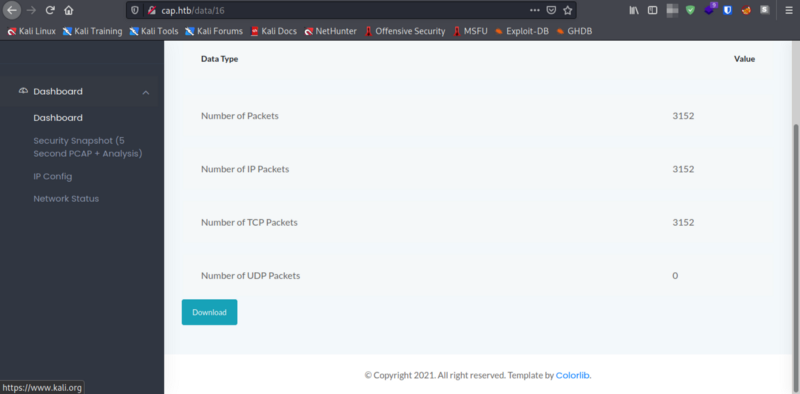
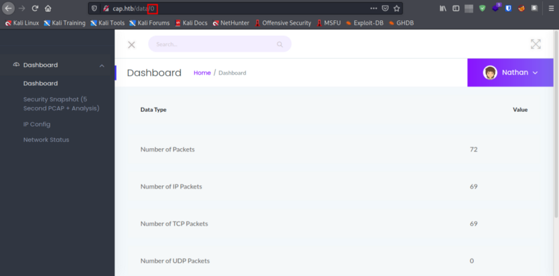
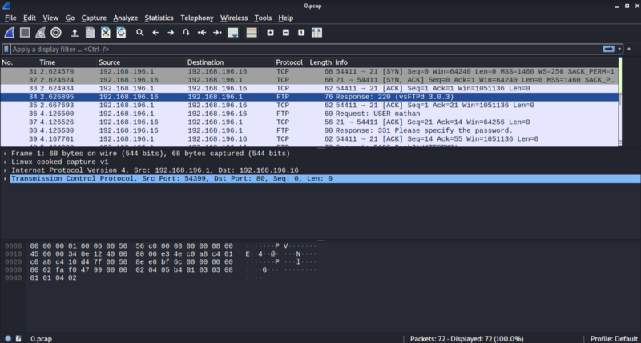
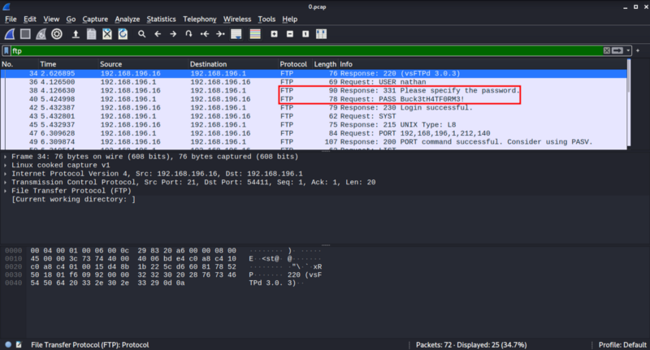
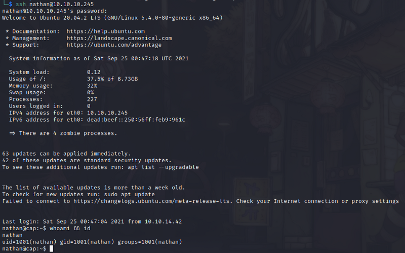

## Box: [Cap](https://www.hackthebox.eu/home/machines/profile/351) by [InfoSecJack](https://www.hackthebox.eu/home/users/profile/52045)

```bash
IP = 10.10.10.245
Difficulty: Easy 
Machine OS: Linux
Learning Platform: hackthebox.eu
Finished on: Kali Linux VM 
```

### **Reconnaissance**

#### *Scoping and Preparation*
* Added IP to `/etc/hosts` file and also stored as environment variable.

Syntax: `sudo vi /etc/hosts` , then press i to enter insert mode and paste the machine IP and add name for that host. (I named it `cap.htb`)

Syntax: `export IP=10.10.10.245`

Preliminary Enumeration via nmap

PORT | STATE | SERVICE |  REASON | VERSION
:---: | :---: | :---: | :---: | :---:
21/tcp | *open* | FTP | syn-ack | *vsftpd 3.0.3*
22/tcp | *open* | SSH | syn-ack | *OpenSSH 8.2p1 Ubuntu 4ubuntu0.2 (Ubuntu Linux; protocol 2.0)*
80/tcp | *open* | HTTP | syn-ack | *gunicorn*


Machine OS: [Ubuntu Focal Fossa](https://launchpad.net/ubuntu/+source/openssh/1:8.2p1-4ubuntu0.2), based on OpenSSH version.
  
### Enumeration

1. Web Enumeration

    * Looking at the web page, we have a security dashboard as seen below.

    

    * There is an interesting tab named `Security Snapshot`. We can navigate through that and we can see that it captures network traffic and lets us download it.

    

    * Looking closely at the URL, we can see that the pages are referenced via page numbers in URL. We can try to manipulate the page number in the URL and we might see interesting `.pcap` file.

    
    

    * Nice! We can see the page zero of the security snapshot!

    * We can download the `.pcap` file and use it against [wireshark](https://www.wireshark.org/)

    * Open `0.pcap` on wireshark.

    Syntax: `wireshark`, then select the `file` tab and open the directory where the `.pcap` file reside.

    

    * We could already see that there is a `FTP` traffic captured in the network.

    * `FTP` authentication is not encrypted, so we can see what's happening in plain text and hopefully we can get some interesting finds here.

    * Voila! We found plaintext credentials on `FTP` authentication traffic!

    

    * We can see the plaintext password of `nathan` user! We can now try to login to `FTP` of `nathan` user.

2. FTP Enumeration

    * Logging to the `FTP` server, we can see what it seems the home directory of `nathan`.

    

    **Files named exploit.c, exploit, linenum.sh are all real user input because of shared instances in the box.**

### Possible Exploits

* Password reuse and using unencrypted communications leading to password leak.
* Insecure Direct Object References in website leading to credential leak.

### Exploitation

* Using IDOR(Insecure Direct Object References), we found unencrypted data hidden on `.pcap` file.
* We logged in via ssh using the credentials found in FTP communications.

#### Credentials Found via Wireshark

`nathan:Buck3tH4TF0RM3!`

#### Privilege Escalation

##### Internal Enumeration

* Via logging in through ssh, we can see the `/home` directory of `nathan` which is also the same directory as we saw earlier in FTP.

* `user.txt` file is also here so we can submit it now. :D
* We start automatic enumeration using [LinPEAS](https://github.com/carlospolop/PEASS-ng).

##### Vertical Privilege Escalation

* Using `LinPEAS` , we see some interesting privilege escalation vector. Linux Capability :D


* You can learn about linux capabilities [here](https://book.hacktricks.xyz/linux-unix/privilege-escalation/linux-capabilities).

**P.S. I highly recommend the linked webpage above because of knowledge you get in here when it comes to penetration testing!**

* `cap_setuid` capability allows changing of UID(User Identification).
* UID 0 is hardcoded UID for `root` user in *nix systems. In some*nix systems there is 2 root users. (refer to this [Discussion](https://superuser.com/questions/626843/does-the-root-account-always-have-uid-gid-0) here.)

To exploit the capability of a binary with `cap_setuid` (in this case `python3.8`):

Syntax: `/usr/bin/python3.8 -c 'import os;os.setuid(0);os.system("/bin/bash");'`

Explanation: runs python3.8 with a command that imports `os` library and sets the UID to 0 (root) and executes `/bin/bash` as root.


* Navigate to `/root/` directory and get your `root.txt` flag!

**Congratulations!**

**STATUS: ROOTED**

*The next two steps are not necessary for completion of the machine but it completes the [5 Phases of Penetration Testing](https://pentaroot.com/five-phases-of-penetration-testing/).*

### Post Exploitation / Maintaining Access

* Copied the `/etc/shadow` file for user identification and their passwords.
* Added another root user for backdoor.

### Clearing Tracks

* Removed all logs and footprints to to prevent risk of exposure of breach to security administrator.

#### Status: Finished

*Feel free to reach out and if there is something wrong about the above post. Feedbacks are also appreciated :D*

#### Donation Box

*Not required but appreciated :D*

[](https://ko-fi.com/hambyhaxx)

[](https://www.buymeacoffee.com/hambyhaxx)


#### Socials

- [Twitter](https://twitter.com/hambyhaxx)
