# [Mr. Robot CTF](https://tryhackme.com/room/mrrobot) by [Ben](https://tryhackme.com/p/ben) & [Leon Johnson](https://twitter.com/@sho_luv)

```bash
IP = 10.10.84.57*
Difficulty: Medium
Machine OS: Linux
Learning Platform: tryhackme.com
Finished on: Arch Linux
```

**Note: IP address may vary.*

## Brief Description

A [Mr. Robot](https://en.wikipedia.org/wiki/Mr._Robot) themed machine (I haven't seen the series itself but I will watch it if I have some time to spare.) which involves getting a foothold in a Wordpress site using the sensitive file we will get on the web server. Without further ado, let's get started in hacking!

## **Reconnaissance**

### *Scoping and Preparation*

Connect to Tryhackme OpenVPN Server using:

* ``sudo openvpn {PATH_TO_OVPN_FILE}``

I used my tool [CTFRecon-Go](https://www.github.com/hambyhacks/CTFRecon-Go) to automate directory creation, port scanning, web directory brute-forcing and adding entry to `/etc/hosts` file.

* To download [CTFRecon-Go] using `git clone` and running it:

```bash
    1. git clone https://github.com/hambyhacks/CTFRecon-Go && cd CTFRecon-Go
    2. go build . 
    3. sudo ./CTFRecon-Go -d [DIRECTORY_NAME] -p [PLATFORM] -i [IP] -w [WORDLIST_TO_USE_FOR_GOBUSTER] #Platform refers to tryhackme or hackthebox (thm, htb respectively.)
```

* You can also download the release binary by using `go install` : `go install github.com/hambyhacks/CTFRecon-Go@latest`

To use `CTFRecon-Go` if installed using `go install`:

* `sudo CTFRecon-Go -d [DIRECTORY_NAME] -p [PLATFORM] -i [IP] -w [WORDLIST_TO_USE_FOR_GOBUSTER]`

## External Enumeration

### *Preliminary Enumeration via nmap*

#### Table 1.1: nmap Results Summary

PORT | STATUS | SERVICE | VERSION
:---: | :---: | :---: | :---:
80/tcp | open | HTTP | *Apache httpd*
443/tcp | open | SSL/HTTP | *Apache httpd*

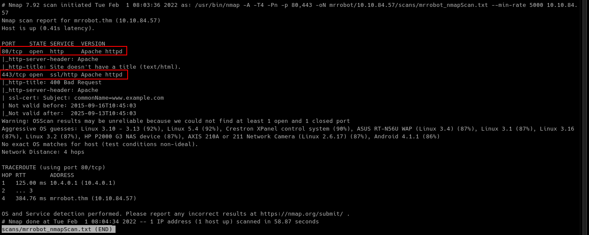

Nmap result does not give so much information, so we need to proceed to enumerate the web server at port 80 and 443.

### Web Enumeration

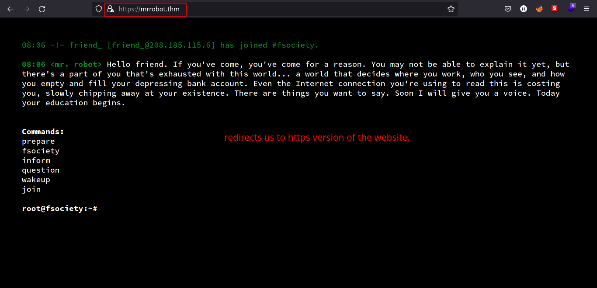

In the webpage, we can see that there are set of commands that we can use to see how the web server works.

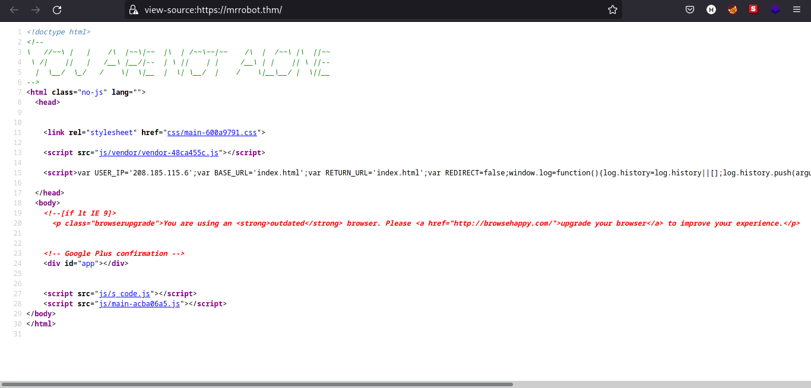

Looking through the source code, we can see there are some `.js` files and looking at them does not help me that much because I can't read javascript files properly.


Using `wappalyzer`, we managed to enumerate the versions of technologies used the web server. The one that stands out is knowing that the webpage is running `WordPress`!

### Content Discovery

By gut feeling, I typed in the URL search bar `robots.txt` to see if there are some sort of directories we can look at and voila, we found some interesting files.

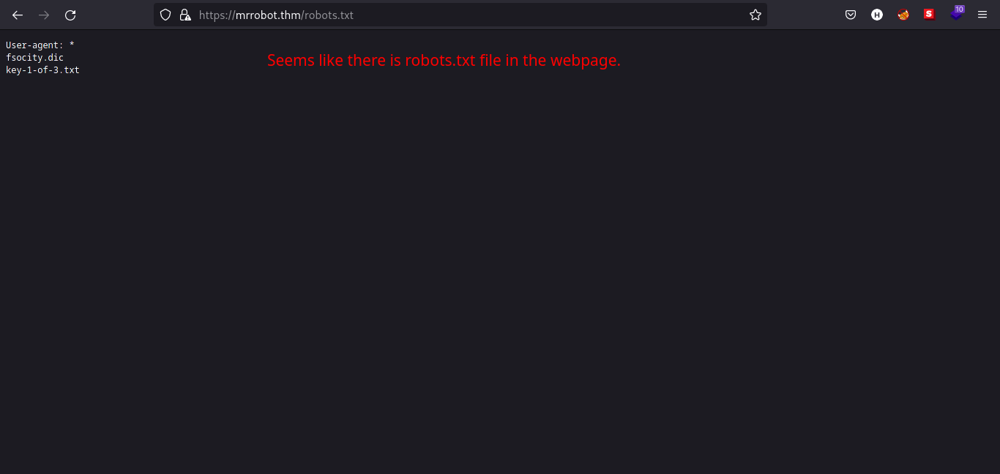

Files named `fsocity.dic` and `key-1-of-3.txt` are listed on `robots.txt` file. Type that in the URL search bar and download them. (*key-1-of-3.txt is the web flag.*)

Let's look inside the contents of the file named `fsocity.dic`. Just by looking at the file extension, I got some feeling that this file is a dictionary file that we can use for bruteforcing the login in webpage specifically in `/wp-login.php`. But for the sake of completeness, we will check the contents of the file.


As shown in the image above, using the `file` command does not give us anything useful. (*if there is something useful, don't hesitate to tell me. I am still a newbie and keeps on learning!*)

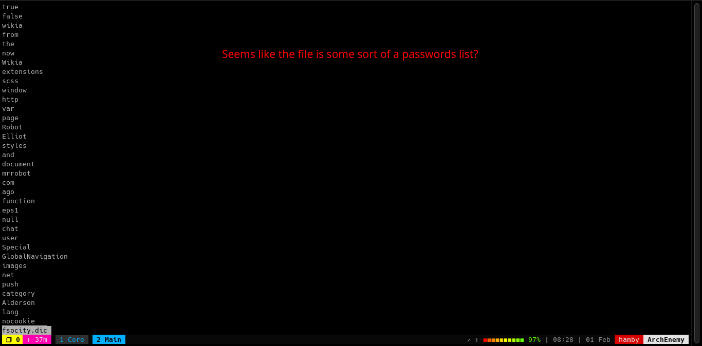

Looking inside the contents of the file `fsocity.dic`, it seems like a passwords list. Let's check how many lines does the file have.


Oof, thats a lot of line count to use in a bruteforcing tool such as `hydra`. But we can check if those lines are duplicate and remove them. We can use the `sort` command.

Syntax:

* `sort -u fsocity.dic > [FILENAME_FOR_SORTED_fsocity.dic]`

Let's check now if there are improvements for the file.


Phew! That's a relief! From 800k+ lines to 11k+ lines. We can now try to use this sorted file in a bruteforce tool such as `hydra` and etc.

Before that, we can navigate through different endpoints in the web server.

Knowing that the webpage is running `WordPress`, we can check the login page by visiting the endpoint: `/wp-login.php`.


We have dictionary for possible usernames and passwords for the machine but 11k lines of words will still take long for us to bruteforce. Since it is a `Mr. Robot` themed box, the name of characters in the series must be one of the username used in the machine. Searching through google, I looked for the characters list.

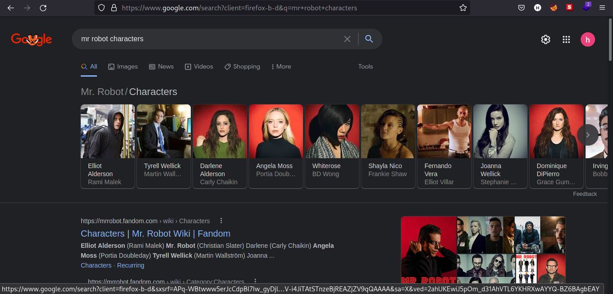

Also by reading the wiki, `Elliot Alderson` is the main character in the series. Let's try if `elliot` is a possible user in the webpage.

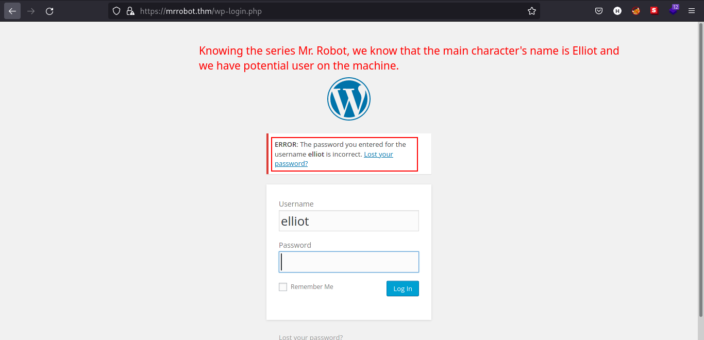

The login form gives so much verbosity that confirms our guess that `elliot` is a valid user in the webpage.

There are 2 exploitation paths we can use:

1. through `xmlrpc.php` or

2. bruteforcing the login page at `wp-login.php`

I used the method 2 because the exploits I found on github are outdated and written in `python2` which gives me a lot to troubleshoot. (*I am still learning how to code and will try to implement the exploit using Golang.*)

## Exploitation

We have a username and possible dictionary of usernames and passwords and we also know that the webpage is running `WordPress`. We can now try to exploit the webpage by bruteforcing the login page in `/wp-login.php`

### Steps to reproduce

1. Intercept the login HTTP request at `/wp-login.php` using `Burp Suite`.

2. At the bottom of HTTP request, copy the line that looks like login parameters. (ex: `log=elliot&pwd=123123123&wp-submit=Log+In&redirect_to=https%3A%2F%2Fmrrobot.thm%2Fwp-admin%2F&testcookie=1`)

3. Using `hydra`, we can now try to brute force the login form by using the module `https-post-form`. I removed the parameter `redirect_to` and added `S` as success string for `hydra` to find if it successfully found the password.

Syntax:

* `hydra -l [USERNAME] -P [PASSWORD_LIST] [IP] https-form-post '/wp-login.php:log=elliot&pwd=^PASS^&wp_submit=Log In&testcookie=1:S=Location' -t 64 -I`

    

4. The `S` string looks for `Location` header in the HTTP response if it successfully logged in the webpage.

5. After some time, `hydra` managed to get the credentials for `elliot`.

    

6. We can now login through the webpage as `elliot`.

7. Still we do not have foothold on the internal machine.

8. I created a `.php` file contains simple and not malicious code, phpinfo().

    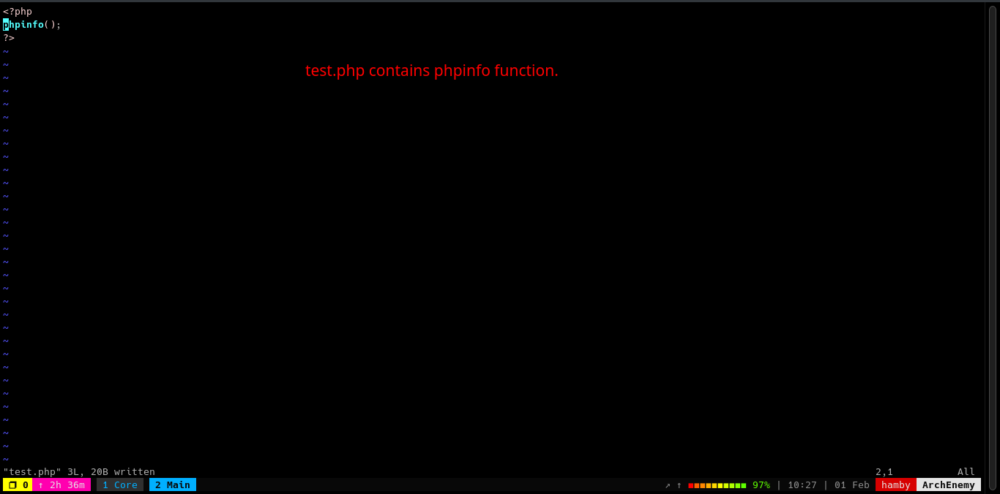

9. We can try to find some upload functionality to test if we can have a shell in the machine.

    

10. We tried to upload `.php` file as media for the post but failed. We can try to confuse the filters and try to upload a `.php` file.

    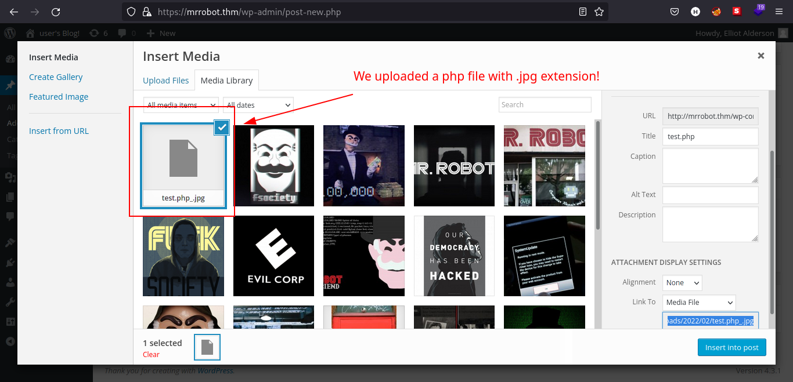

11. Yay! We successfully bypassed the upload filter! But the real question is, will it run?

    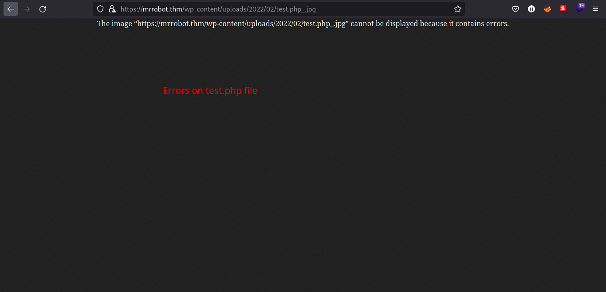

12. Sadly, there is an error on our file, so we need to find another way to have foothold.

13. Looking at `/wp-admin/theme-editor.php`, we can edit some code!

14. Let's try to edit some templates specifically `404.php` which loads when the web server receives HTTP 404 error as response.

    

15. But where do we find the templates we just editted? Let's ask google!

    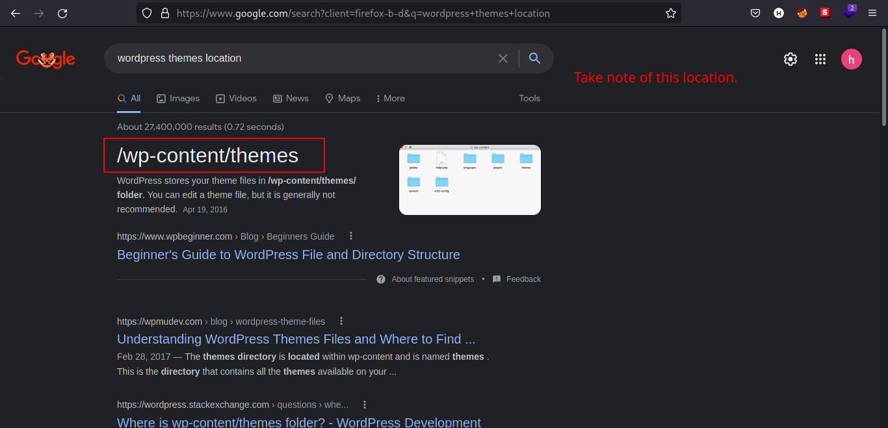

16. We now know where it resides and the theme we are editing is named `twenty-fifteen`. We can guess that the theme resides in `/wp-content/themes/twenty-fifteen/404.php`

    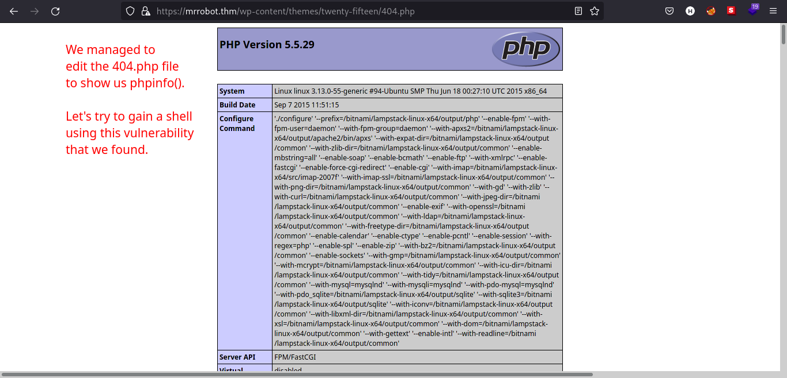

17. Since the edited `404.php` file can be executed, we can try to edit again the file so we can gain a shell on the machine.

    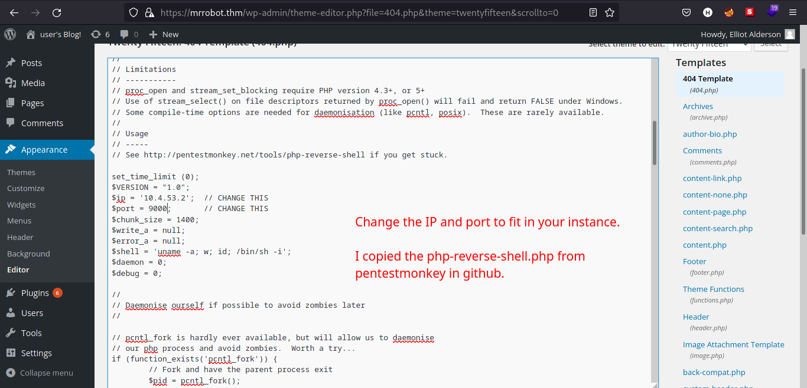

18. Using [PentestMonkey's](https://github.com/pentestmonkey/php-reverse-shell/blob/master/php-reverse-shell.php) php reverse shell, I edited the `404.php` to a reverse shell file.

19. Start a netcat listener at your specified port and navigate to `/wp-content/themes/twenty-fifteen/404.php`

    Syntax:

    * `nc -lvnp [PORT]`

20. Reverse shell should pop after navigating to `404.php`!

    

### Table 1.2: Credentials

Username | Password
:---: | :---:
elliot | ER28-0652
robot | abcdefghijklmnopqrstuvwxyz

## Post-Exploitation

### *Internal Enumeration*

#### Table 1.3: Checklist for Linux Internal Enumeration

COMMAND | DESCRIPTION
:---: | :---:
``ss -tlnp``  | lists all sockets (``-t = tcp``) (``-l = listening``) (``-n = numeric``) (``-p = processes``)
``netstat -tulnp`` | &nbsp; |  &nbsp;
``sudo -l`` | lists all binaries/files/programs the current user has ``sudo`` permissions. (might require password)
``find / -type f -user root -perm -u+s 2>/dev/null`` | finds files in ``/`` directory that has [SUID](https://www.hackingarticles.in/linux-privilege-escalation-using-suid-binaries/) bit set. If any, consult [GTFOBins](https://gtfobins.github.io/).
``uname -a`` | prints system information (-a = all)
``whoami && id`` | prints `effective userid` (EUID) and prints `real` and `effective userid` and `groupids` (GID).
``cat /etc/crontab`` | checks for cron jobs.

*Notes: For more information about the commands look [here](https://explainshell.com)*

*Tip: When nothing else makes sense, try to use [LinPEAS](https://github.com/carlospolop/PEASS-ng) ([winPEAS](https://github.com/carlospolop/PEASS-ng) for windows machines.).*

Navigating through the machine, we can see there is `python3` binary and also enumerated the users in the machine which has name `robot`.

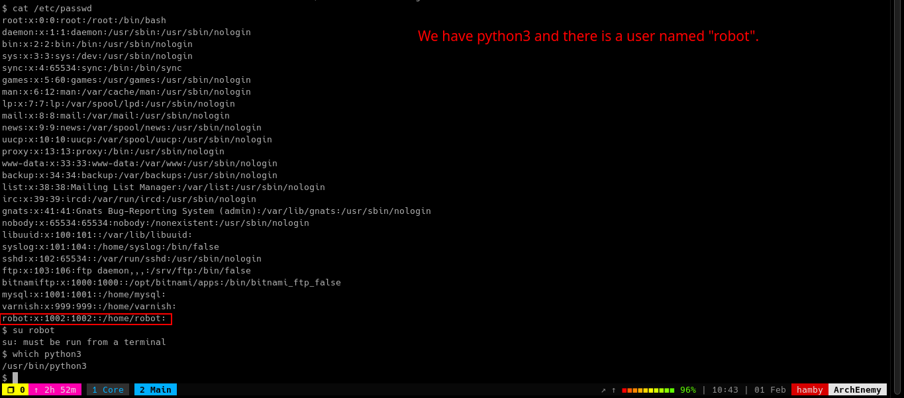

Let's look at the `/home/robot` directory contents.


Using [CrackStation](https://crackstation.net), we managed to retrieve the password for `robot` user!


Such a simple but long password! We can now move laterally using `robot`.


We cannot use `sudo` as `robot`.

### *Privilege Escalation*

Using the checklist above, I looked first if there are `SUID` binaries that we can use for privilege escalation.

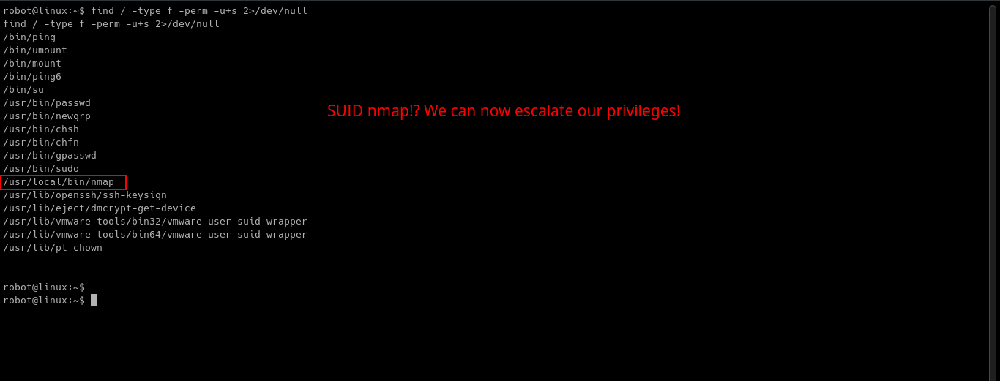

We have `nmap` binary that has `SUID` permissions! Let's check out [GTFOBins](https://gtfobins.github.io) to see if we can use this as a vector for privilege escalation. Which turns out we can!


To elevate our privileges:

1. Type `/usr/local/bin/nmap --interactive`.

2. Then, type: `!sh`. Since the `nmap` binary runs as **root**, we can spawn **root** shell.


### STATUS: ROOTED

The next two steps are not necessary for completion of the machine but it completes the 5 Phases of Penetration Testing.

## Persistence

Copied the /etc/shadow file for user identification and their passwords.

Added another root user for easy access.

## Clearing Tracks

Removed all logs and footprints to to prevent risk of exposure of breach to security administrator.

## Status: Finished

Feel free to reach out and if there is something wrong about the above post. Feedbacks are also appreciated! :D

## Donation Box

Not required but appreciated! :D

[](https://ko-fi.com/hambyhaxx)

[](https://www.buymeacoffee.com/hambyhaxx)

### Socials

* [Twitter](https://twitter.com/hambyhaxx)

* [Medium](https://hambyhaxx.medium.com)

<-- [Go Back](https://hambyhacks.github.io)
