# [Overpass 3 - Hosting](https://tryhackme.com/room/overpass3hosting) by [NinjaJc01](https://tryhackme.com/p/NinjaJc01)

```bash
IP = 10.10.226.31*
Difficulty: Medium
Machine OS: Linux
Learning Platform: tryhackme.com
Finished on: Arch Linux
```

**Note: IP address may vary.*

## Brief Description

This is the 3rd part of the Overpass series which highlight the dangers of misconfigured web server, which in this case, a backup file that contains sensitive information lead to web server compromise also this room shows that NFS shares should be properly secured. To read the previous series, click [here](https://hambyhacks.github.io/Writeups/TryHackMe/Overpass/Overpass) and [here](https://hambyhacks.github.io/Writeups/TryHackMe/Overpass2-Hacked/Overpass2-Hacked).

## **Reconnaissance**

### *Scoping and Preparation*

Connect to OpenVPN Server using:

* ``sudo openvpn {PATH_TO_OVPN_FILE}``

I used my tool [CTFRecon-Go](https://www.github.com/hambyhacks/CTFRecon-Go) to automate directory creation, port scanning, web directory brute-forcing and adding entry to `/etc/hosts` file.

* To download [CTFRecon-Go] using `git clone` and running it:

```bash
    1. git clone https://github.com/hambyhacks/CTFRecon-Go && cd CTFRecon-Go
    2. go build . 
    3. sudo ./CTFRecon-Go -d [DIRECTORY_NAME] -p [PLATFORM] -i [IP] -w [WORDLIST_TO_USE_FOR_GOBUSTER] #Platform refers to tryhackme or hackthebox (thm, htb respectively.)
```

* You can also download the release binary by using `go install` : `go install github.com/hambyhacks/CTFRecon-Go@latest`

To use `CTFRecon-Go` if installed using `go install`:

* `sudo CTFRecon-Go -d [DIRECTORY_NAME] -p [PLATFORM] -i [IP] -w [WORDLIST_TO_USE_FOR_GOBUSTER]`

## External Enumeration

### *Preliminary Enumeration via nmap*

#### Table 1.1: nmap Results Summary

PORT | STATUS | SERVICE | VERSION
:---: | :---: | :---: | :---:
21/tcp | open | FTP | *vsftpd 3.0.3*
22/tcp | open | SSH | *OpenSSH 8.0 (protocol 2.0)*
80/tcp | open | HTTP | *Apache httpd 2.4.37 ((centos))*

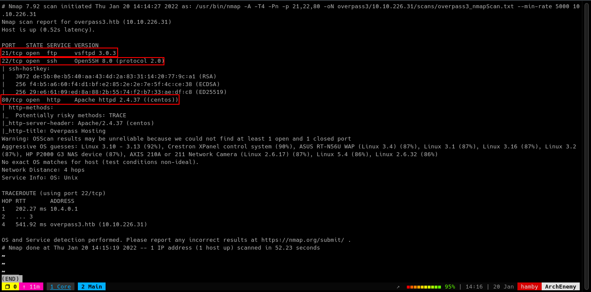

Let's look at the `HTTP` server on port 80.

### Web Enumeration


We can see that in the webpage, Overpass is now offering web and email hosting solutions. Let's now look at the source code of the web page.


Looks like the developer is doubting about the reliability of their service.


We can see that the webpage is running Apache with CentOS as their operating system. The web server is likely running `.php` files.

Let's see the result of the `GoBuster` scan result done by CTFRecon-Go.

### GoBuster Scan


It seems that there is a directory named `/backups`, which seems interesting to us.


There is a `backup.zip` file on `/backups` directory. Let's download the file and see its contents.

### Content Discovery


We got `CustomerDetails.xlsx.gpg` and `priv.key` inside `backup.zip`. Lets's try to decrypt the spreadsheet file using `gpg`.


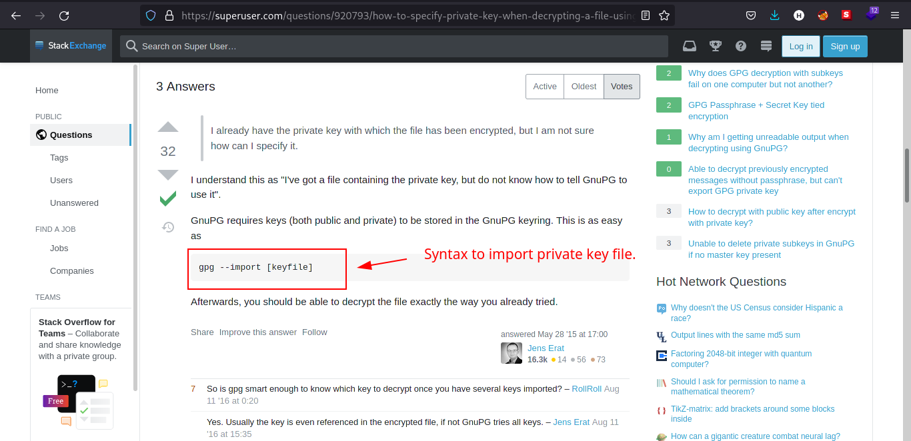

First, we need to import the private key using the command:

* `gpg --import [keyfile]`

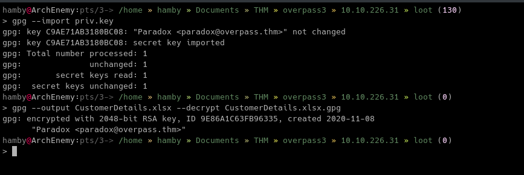

To decrypt the file:

* `gpg --output [output file] --decrypt [encrypted file]`

Let's look inside the spreadsheet file!

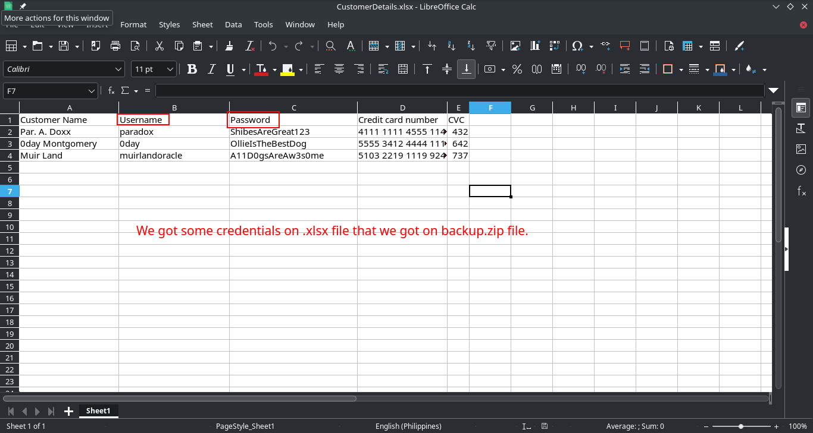

Nice! We got some credentials for us to use. Let's look at the `FTP` service if these credentials are useful to us.

## FTP Enumeration

Let's try some of the credentials in the `FTP` service.


As shown in the image above, we tried to login as `muirlandoracle` with the creds we got but it failed. Logging in as `paradox` gives us login access to `FTP` service.


Looks like the `FTP` server is a mirror of web server. We can verify it by uploading a simple `.txt` file and try to read its contents. I uploaded a file named `test.txt` via `FTP`.

To upload a file via `FTP`:

* `put [file]`

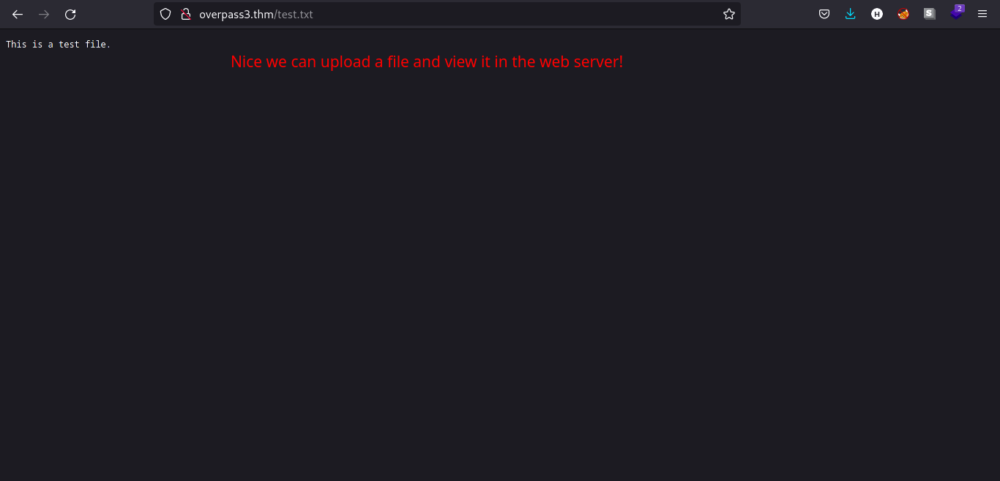

Let's try a `.php` file since the web server is running `Apache`.

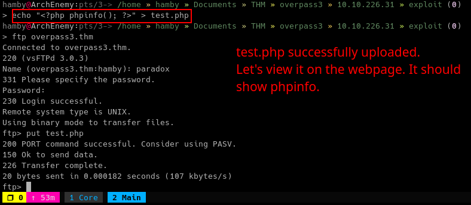

Seems like our `.php` file is uploaded successfully. Let's view the contents of the file. We should be greeted by `phpinfo()` content.

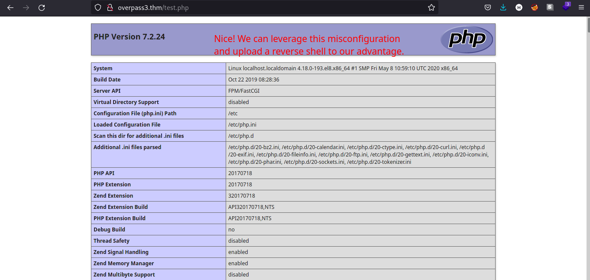

## Exploitation

Knowing that we can upload `.php` file and execute it, we can try to upload a reverse shell and get a foothold in the machine. Download the reverse shell [here](https://github.com/pentestmonkey/php-reverse-shell)


We need to edit the file to successfully catch the reverse shell using `netcat`. Edit the `IP` and `port` variables to **match** your IP and desired port.


Open up a listener using `netcat`. To do this:

* `nc -lvnp [PORT]`

Upload the updated reverse shell file via `FTP` service and navigate to webpage where we uploaded the malicious `.php` file. It should be on web root (e.g., `overpass3.thm/[filename].php`)


### Table 1.2: Credentials

Name | Username | Password
:---: | :---: | :---:
Par. A. Doxx    | paradox | ShibesAreGreat123
0day Montgomery | 0day | OllieIsTheBestDog
Muir Land | muirlandoracle | A11D0gsAreAw3s0me

## Post-Exploitation

### *Internal Enumeration*

#### Table 1.3: Checklist for Linux Internal Enumeration

COMMAND | DESCRIPTION
:---: | :---:
``ss -tlnp``  | lists all sockets (``-t = tcp``) (``-l = listening``) (``-n = numeric``) (``-p = processes``)
``netstat -tulnp`` | &nbsp; |  &nbsp;
``sudo -l`` | lists all binaries/files/programs the current user has ``sudo`` permissions. (might require password)
``find / -type f -user root -perm -u+s 2>/dev/null`` | finds files in ``/`` directory that has [SUID](https://www.hackingarticles.in/linux-privilege-escalation-using-suid-binaries/) bit set. If any, consult [GTFOBins](https://gtfobins.github.io/).
``uname -a`` | prints system information (-a = all)
``whoami && id`` | prints `effective userid` (EUID) and prints `real` and `effective userid` and `groupids` (GID).
``cat /etc/crontab`` | checks for cron jobs.

*Notes: For more information about the commands look [here](https://explainshell.com)*

*Tip: When nothing else makes sense, try to use [LinPEAS](https://github.com/carlospolop/PEASS-ng) ([winPEAS](https://github.com/carlospolop/PEASS-ng) for windows machines.).*

Let's check the `/etc/passwd` file to see which users has login shell.


Let's stabilize the shell by using `python3`.


To upgrade the shell:

* `python3 -c 'import pty;pty.spawn("/bin/bash")'`

Let's try to login as `paradox` since we have his/her creds.

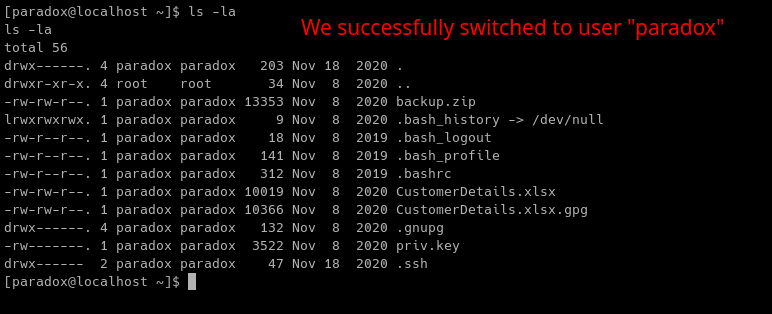

We also tried to enumerate binaries with `SUID` permissions.

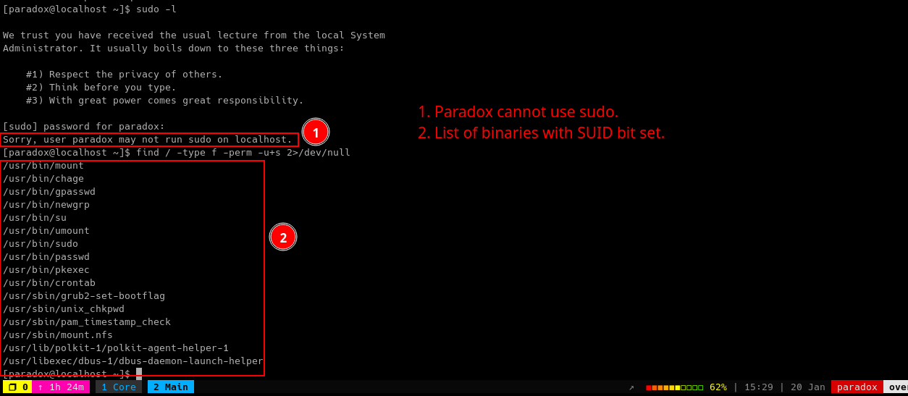

Looking at the questions for this room, there is a hidden web flag needed to complete the room. Let's find it using the `find` command.


Let's also look which ports are open on the machine. To do this:

* `ss -tulnp`

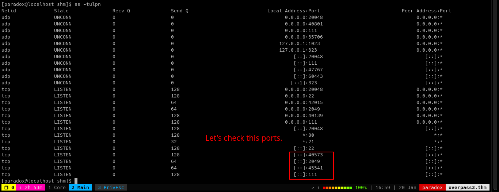

We know about the HTTP,SSH, and FTP open but port `2049` is an NFS server and not enumerated by `nmap` because it is only served at `localhost`.

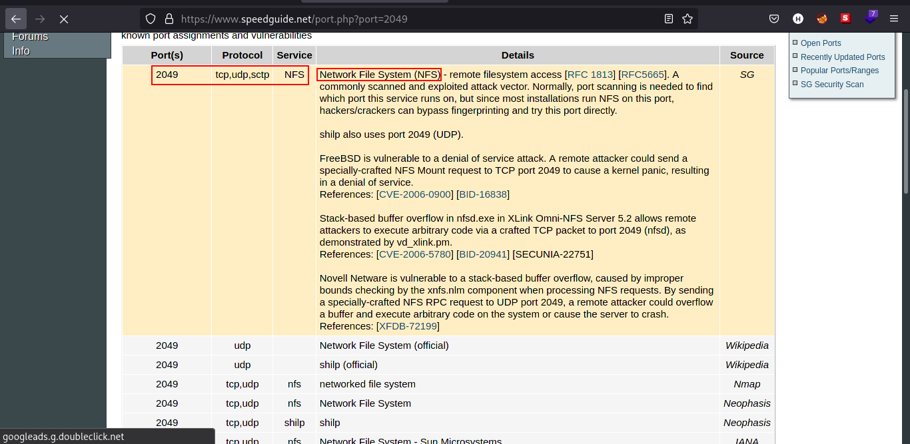

Let's create a `SSH` tunnel to view which shares are accessible through `NFS`.


### *Privilege Escalation*

After several minutes, I stopped manual enumeration and uploaded `LinPEAS` to the machine.

`LinPEAS` shown a Privilege Escalation Vector in `/etc/exports` showing that it is set to `no_root_squash` option.


To elevate our privileges:

1. In the attacking machine, create a directory for mounting the `NFS` shares. In this case, i created `tmp/PrivEsc` directory for mounting the vulnerable share.

    * `sudo mount -v -t nfs 127.0.0.1:/ [MOUNT DIRECTORY]`

    

2. Check the contents of mounted `NFS` share.

    

3. We copied `james` private key (`id_rsa`) and logged in via SSH.

4. In the victim machine, we copied the `bash` binary to `james` home directory.

    * `cp /bin/bash bash`

    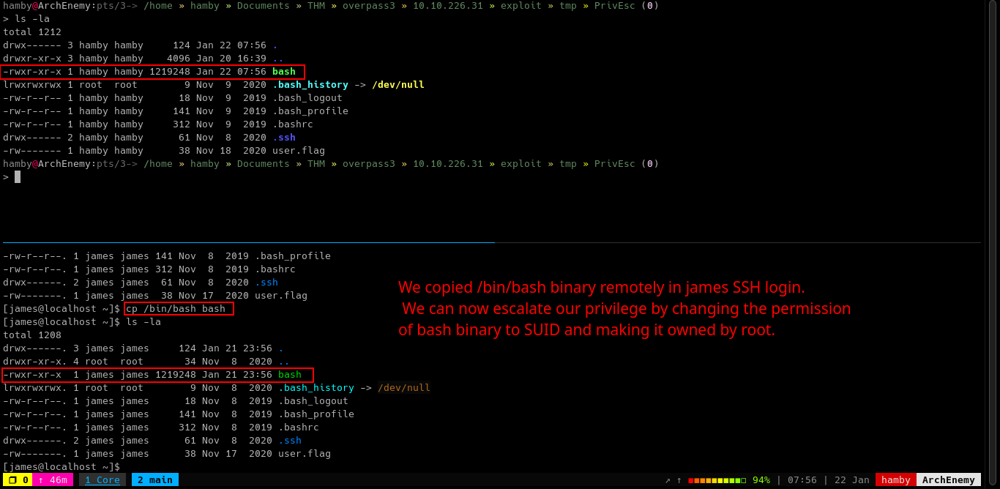

5. In our attacking machine, we changed the ownership and permissions of the `bash` binary.

    * `sudo chown root:root bash`
    * `sudo chmod +s bash`

    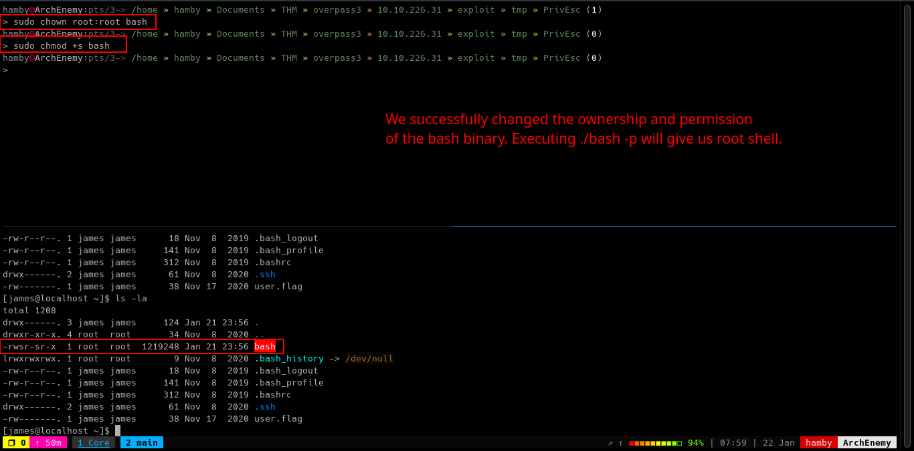

6. In the victim machine, execute the `bash` binary with `-p` flag to gain root shell.

    * `./bash -p`

Now we are root!


### STATUS: ROOTED

The next two steps are not necessary for completion of the machine but it completes the 5 Phases of Penetration Testing.

## Persistence

Copied the /etc/shadow file for user identification and their passwords.

Added another root user for easy access.

## Clearing Tracks

Removed all logs and footprints to to prevent risk of exposure of breach to security administrator.

## Status: Finished

Feel free to reach out and if there is something wrong about the above post. Feedbacks are also appreciated! :D

## Donation Box

### *Not required but appreciated! :D*

[](https://ko-fi.com/hambyhaxx)

[](https://www.buymeacoffee.com/hambyhaxx)

### Socials

* [Twitter](https://twitter.com/hambyhaxx)

* [Medium](https://hambyhaxx.medium.com)

* [Hashnode](https://hambyhacks.hashnode.dev)

<-- [Go Back](https://hambyhacks.github.io)
