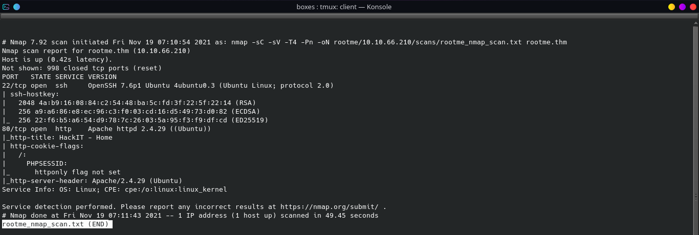
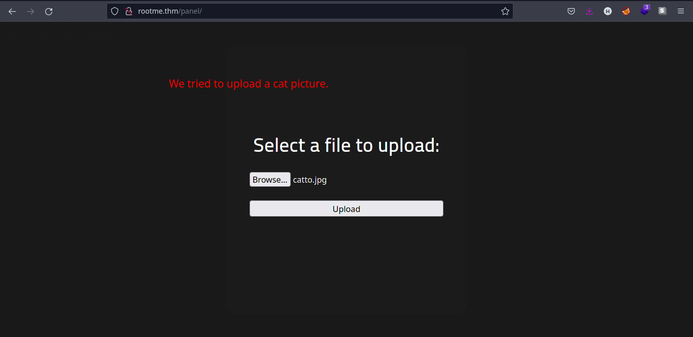
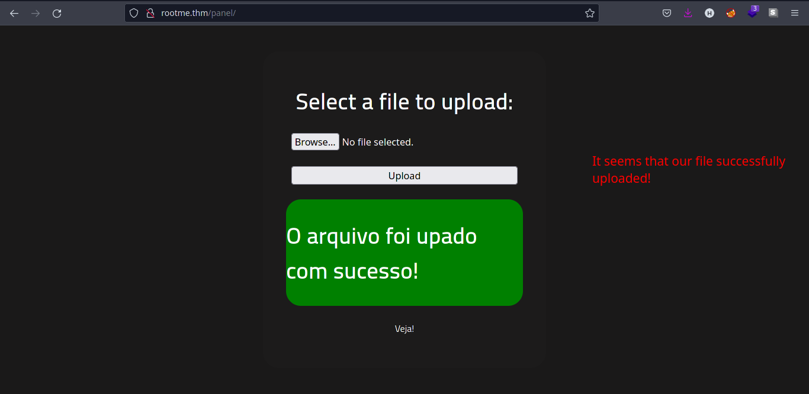
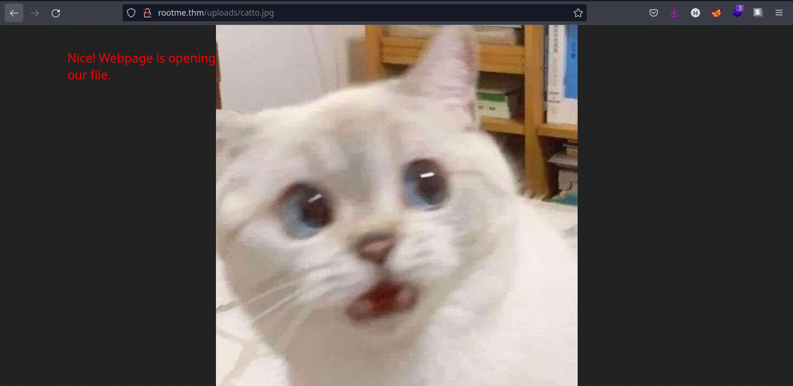
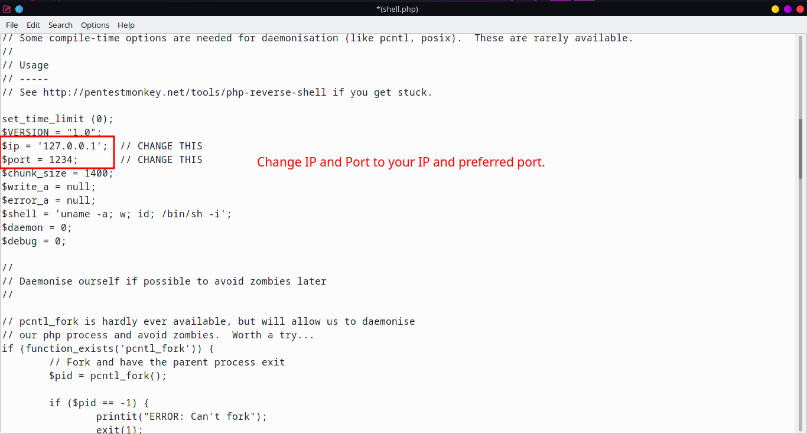
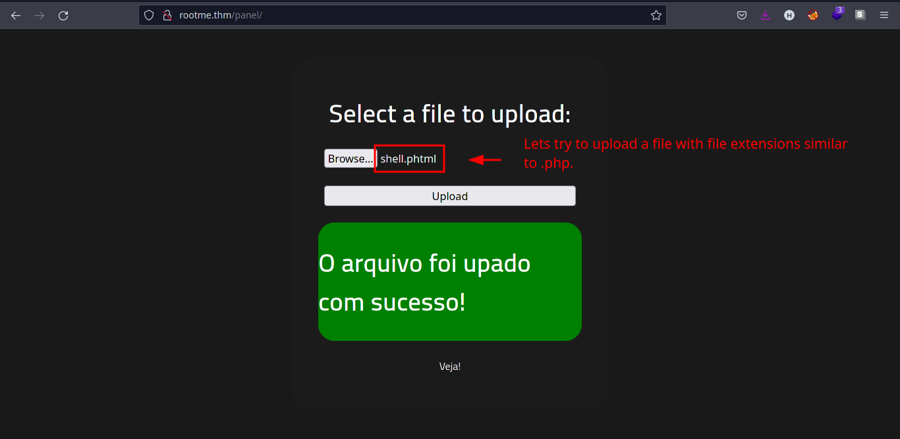
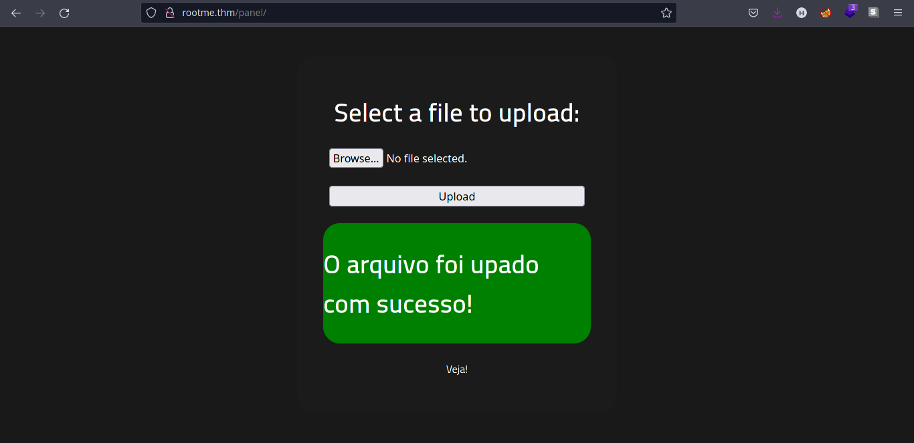
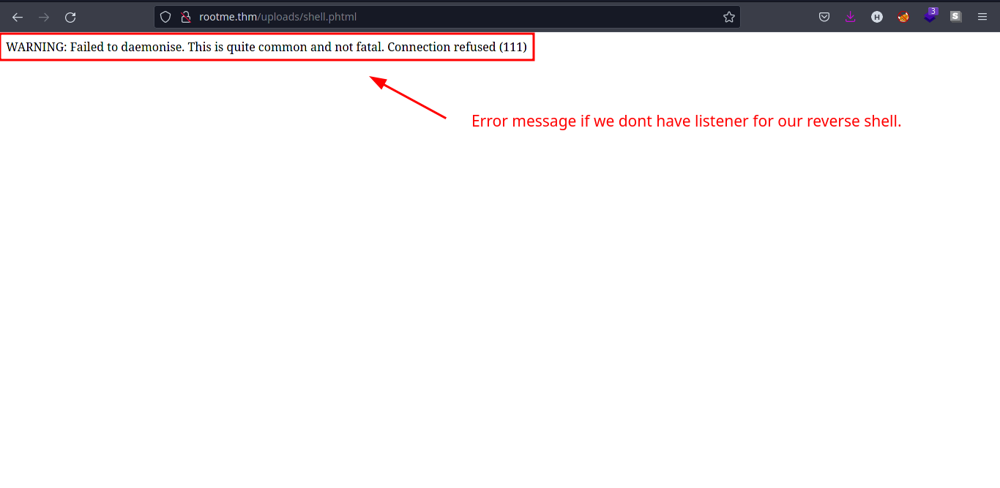

## [RootMe](https://tryhackme.com/room/rrootme) by [ReddyyZ](https://tryhackme.com/p/ReddyyZ)

```bash
IP = 10.10.66.210*
Difficulty: Easy 
Machine OS: Linux
Learning Platform: tryhackme.com
Finished on: Arch Linux
```

**Note: IP address may vary.*

### **Reconnaissance**

#### *Scoping and Preparation*

* Connect to OpenVPN Server using:

    ``sudo openvpn {PATH_TO_OVPN_FILE}``

* I used my tool [CTFRecon](https://www.github.com/hambyhacks/CTFRecon) to automate directory creation, network scanning, web directory brute-forcing and adding entry to `/etc/hosts` file.

* To use [CTFRecon](https://www.github.com/hambyhacks/CTFRecon):

    ```bash
    1. git clone https://www.github.com/hambyhacks/CTFrecon
    2. cd CTFRecon
    3. chmod +x ctfrecon.sh && cp ctfrecon.sh ../ 
    #to move ctfrecon.sh to your working directory.
    4. sudo ./ctfrecon.sh [IP] [DIRECTORY NAME] [PLATFORM] [WORDLIST] 
    #platform refers to hackthebox(htb) or tryhackme(thm). Wordlist is used for GoBuster directory brute-forcing.
    ```

#### *Preliminary Enumeration via nmap*

**Table 1.1: nmap Results Summary**

PORT | STATUS | SERVICE | VERSION
:---: | :---: | :---: | :---:
22/tcp | open | SSH | OpenSSH 7.6p1 Ubuntu 4ubuntu0.3 (Ubuntu Linux; protocol 2.0)
80/tcp | open | http | Apache httpd 2.4.29 ((Ubuntu))



Machine OS: Based on OpenSSH version, machine is [Ubuntu Bionic](https://launchpad.net/ubuntu/+source/openssh/1:7.6p1-4ubuntu0.3)

### Enumeration

#### *Manual Web Enumeration*

* Looking at the webpage at port 80, we are greeted by this webpage below.


* We can also look at the web technologies used in ``rootme.thm`` using [Wappalyzer](https://www.wappalyzer.com/).


* Let's enumerate more using automated tools.

*Note: Manual Enumeration is important.*

#### *Web Enumeration using GoBuster*

* Using [GoBuster](https://github.com/OJ/gobuster), we found some interesting directories.


* As we can see above, there is a ``/panel`` directory! Let's try to navigate to that.


* Nice! An upload page. We can try to upload some files to determine which file extensions are accepted.





* Our file is also getting executed by the webpage.



* We can try another file extensions to test the upload functionality even more. Knowing that the webpage is using ``PHP``, we try to upload a [PHP reverse shell](https://github.com/pentestmonkey/php-reverse-shell) to get a foothold on the machine. Change your IP to your assigned IP and port to your preferred port for capturing the reverse shell. To know which IP you are assigned to:

    Syntax: ``ip a s tun0``

* Also you can view the room page of [RootMe](https://tryhackme.com/room/rrootme) machine to get your IP. Make sure that you are connected to the VPN.



* We also tried to confuse the filter for the file upload functionality by appending another extension to our file. You can simply change the file extension by using the ``mv`` command.

    Syntax: ``mv {FILE} {NEW_FILENAME}.{FILE_EXTENSION}``

    Ex: ``mv test.php test.php.jpg``

* Appending another file extension does not work so we try to do change the file extension similar to ``.php``. We can refer to [this](https://book.hacktricks.xyz/pentesting-web/file-upload) excellent resource for someone who is aspiring to learn more about cybersecurity.

*Tip: When in doubt, search it in Google.*

### Exploitation

*Steps to reproduce:*

1. Rename the file extension we used for our reverse shell.

    ex: ``mv shell.php shell.phtml``

2. Go to the vulnerable endpoint, in this case, a file upload page (``https://rootme.thm/panel``) and upload our modified reverse shell file.

    

    

3. Start ``netcat`` as reverse shell listener.

    Syntax: ``nc -lvnp {PORT}``

4. Go to ``/uploads/`` directory to view our uploaded file and click on it. Make sure you provided the right IP to the reverse shell otherwise the shell would not pop.

5. To verify if our IP is correct in the reverse shell file:

    

    To fix: Set up a listener for the connection.

6. Setting up the reverse shell listener, it should look like this:

    

7. We can also upgrade our shell session to clear the screen. To do this:

    

### Privilege Escalation / Post-Exploitation

#### *Internal Enumeration*

**Table 1.2: Checklist for Linux Internal Enumeration**

COMMAND | DESCRIPTION
:---: | :---:
``ss -tlnp``  | lists all sockets (``-t = tcp``) (``-l = listening``) (``-n = numeric``) (``-p = processes``)
``netstat -tulnp`` | &nbsp; |  &nbsp;
``sudo -l`` | lists all binaries/files/programs the current user has ``sudo`` permissions. (might require password)
``find / -type f -user root -perm -u+s 2>/dev/null`` | finds files in ``/`` directory that has [SUID](https://www.hackingarticles.in/linux-privilege-escalation-using-suid-binaries/) bit set. If any, consult [GTFOBins](https://gtfobins.github.io/).
``uname -a`` | prints system information (-a = all)

*Notes: For more information about the commands look [here](https://explainshell.com)*
*Tip: When nothing else makes sense, try to use [LinPEAS](https://github.com/carlospolop/PEASS-ng) ([winPEAS](https://github.com/carlospolop/PEASS-ng) for windows machines.).*

* Navigating to (~) or home directory, we found ``user.txt`` flag.

* Running our checklist, we found that using ``find / -type f -user root -perm -u+s 2>/dev/null`` found a binary that does not belong to typical binaries with [SUID](https://www.hackingarticles.in/linux-privilege-escalation-using-suid-binaries/) bits in their permission.

    Binary: ``/usr/bin/python``

#### *Vertical Privilege Escalation*

* We can use [GTFOBins](https://gtfobins.github.io) to check if we can exploit it to escalate our privileges. To exploit ``python`` binary:

    1. ``cd /usr/bin`` this is the directory where the ``python`` binary reside.
    2. Type in the terminal: ``./python -c 'import os; os.execl("/bin/sh", "sh", "-p")'``. This command runs the python binary and executes a persistent shell with root privileges because of the SUID bit.

    

    3. ``#`` denotes that we are root user on the machine.

* Navigate to /root/ directory and get your root.txt flag!

**STATUS: ROOTED**

The next two steps are not necessary for completion of the machine but it completes the 5 Phases of Penetration Testing.

### Post Exploitation / Maintaining Access

* Copied the /etc/shadow file for user identification and their passwords.

* Added another root user for easy access.

### Clearing Tracks

* Removed all logs and footprints to to prevent risk of exposure of breach to security administrator.

## **Status: Finished**

Feel free to reach out and if there is something wrong about the above post. Feedbacks are also appreciated :D

### Donation Box

*Not required but appreciated :D*

[](https://ko-fi.com/hambyhaxx)

[](https://www.buymeacoffee.com/hambyhaxx)
