# [SimpleCTF](https://tryhackme.com/room/easyctf) by [MrSeth6797](https://tryhackme.com/p/MrSeth6797)

```bash
IP = 10.10.56.201*
Difficulty: Easy
Machine OS: Linux
Learning Platform: tryhackme.com
Finished on: Arch Linux
```

**Note: IP address may vary.*

## **Reconnaissance**

### *Scoping and Preparation*

* Connect to OpenVPN Server using:

    ``sudo openvpn {PATH_TO_OVPN_FILE}``

* I used my tool [CTFRecon](https://www.github.com/hambyhacks/CTFRecon) to automate directory creation, network scanning, web directory brute-forcing and adding entry to `/etc/hosts` file.

* To use [CTFRecon](https://www.github.com/hambyhacks/CTFRecon):

    ```bash
    1. git clone https://www.github.com/hambyhacks/CTFrecon
    2. cd CTFRecon
    3. chmod +x ctfrecon.sh && cp ctfrecon.sh ../ 
    #to move ctfrecon.sh to your working directory.
    4. sudo ./ctfrecon.sh [IP] [DIRECTORY NAME] [PLATFORM] [WORDLIST] 
    #platform refers to hackthebox(htb) or tryhackme(thm). Wordlist is used for GoBuster directory brute-forcing.
    ```

### *Preliminary Enumeration via nmap*

#### Table 1.1: nmap Results Summary

PORT | STATUS | SERVICE | VERSION
:---: | :---: | :---: | :---:
21/tcp | open | FTP | *vsftpd 3.0.3*
80/tcp | open | HTTP | *Apache httpd 2.4.18 ((Ubuntu))*
2222/tcp | open | SSH | *OpenSSH 7.2p2 Ubuntu 4ubuntu2.8 (Ubuntu Linux; protocol 2.0)*

* Based on `nmap` result below, we can see that the `FTP` port can be accessed anonymously and the `SSH` port is not in the standard port.


  Machine OS: Based on OpenSSH version, machine is [Ubuntu Xenial](https://launchpad.net/ubuntu/+source/openssh/1:7.2p2-4ubuntu2.8).

## Enumeration

### FTP Enumeration

* Let's look at the `FTP` service that is running and we can access anonymously. To login anonymously in `FTP` service:

    Type `anonymous` as the username and press enter as a password. It should log in as `anonymous` user.

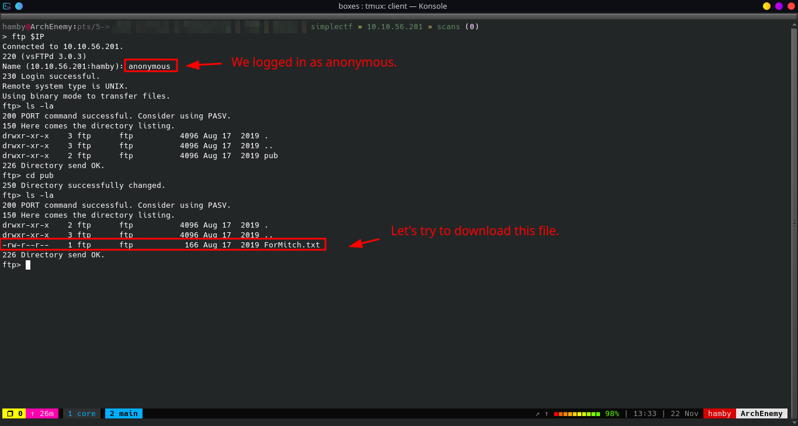

* Inside the `FTP` service, we found some interesting file named `ForMitch.txt` that could also give us a possible username for the machine.
* Lets try to download the file `ForMitch.txt` and see the contents. To download the file, we can use the command `GET` to download the file we wanted.

  * Syntax: `get {FILENAME}`

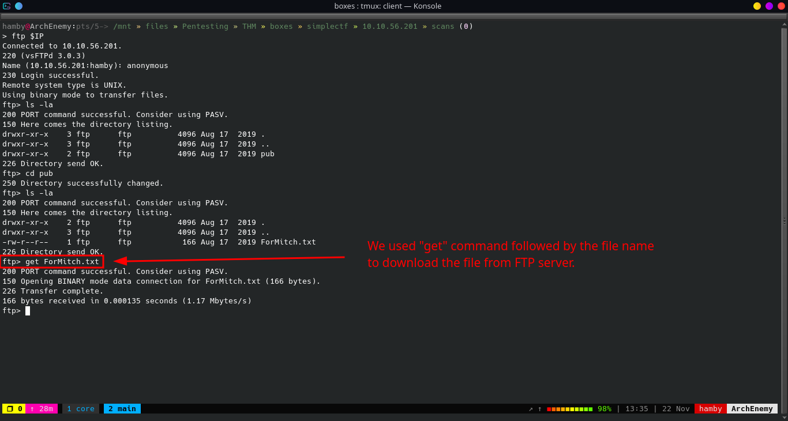

* We can now exit the `FTP` prompt and check the contents of the file `ForMitch.txt`.


* The `.txt` file we downloaded from the `FTP` server tells us about the password hygiene of the developers especially the user named `Mitch`. The note tells us that `Mitch`'s password is reused in system machine and it is also weak that it can be cracked in seconds.
* Let's now move on to web enumeration!

### *Manual Web Enumeration*

* Looking at the webpage at port 80, we are greeted with Apache Default Page.


* We try to manually check for some directories such as `robots.txt` and we found some entry on the file.

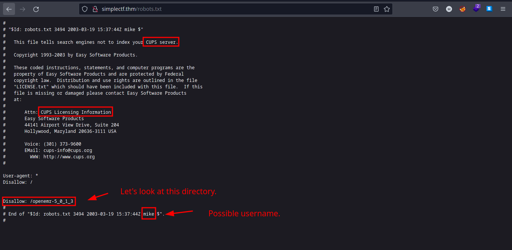

* We can try to navigate in the directory `/openemr-5_0_1_3` specified in the `robots.txt` file. Unluckily, this directory is not present in the webpage.

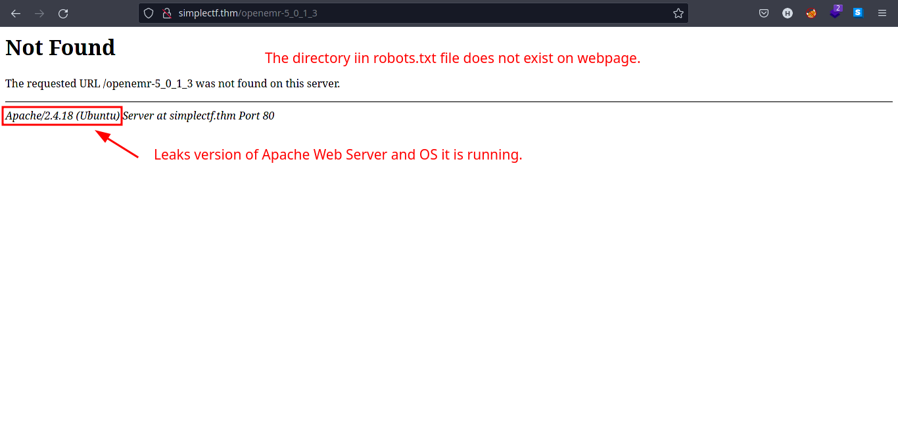

* Let's enumerate more using automated tools.

*Note: Manual Enumeration is important.*

### *Web Enumeration using GoBuster*

* Using [GoBuster](https://github.com/OJ/gobuster), we found some interesting directories.
  * Syntax: `gobuster dir -u {IP} -w {PATH_TO_WORDLIST}`

* Let's look at the result of ``GoBuster`` scan on port `80`.


* We can see that there is a directory named `/simple`. Let's navigate to `/simple` directory and see its contents.


* We found out that the `/simple` directory has a CMS named `CMS Made Simple`. We can try to find if the version number is somewhere on the webpage.

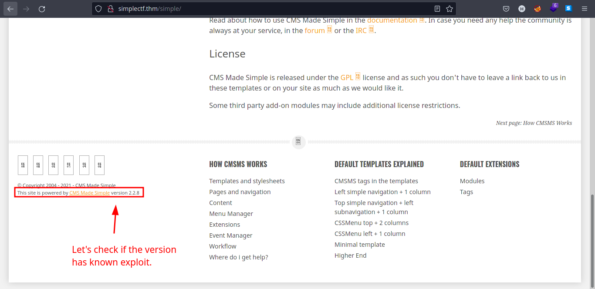

### *Version Exploit Enumeration*

* We found the version number of `CMS Made Simple` (*version 2.2.8*). Let's try to find if there is an exploit for this version of `CMS Made Simple`. We searched for exploit in `searchsploit`. Do not be too specific when searching using `searchsploit` as it tends to break if you search for specific query.
  * Syntax: `searchsploit {QUERY}`


* Mirror the exploit script using searchsploit.
  * Syntax: `searchsploit -m {PATH_TO_SCRIPT}`
  * Change the name of the exploit to more readable name. (*optional*)
  
  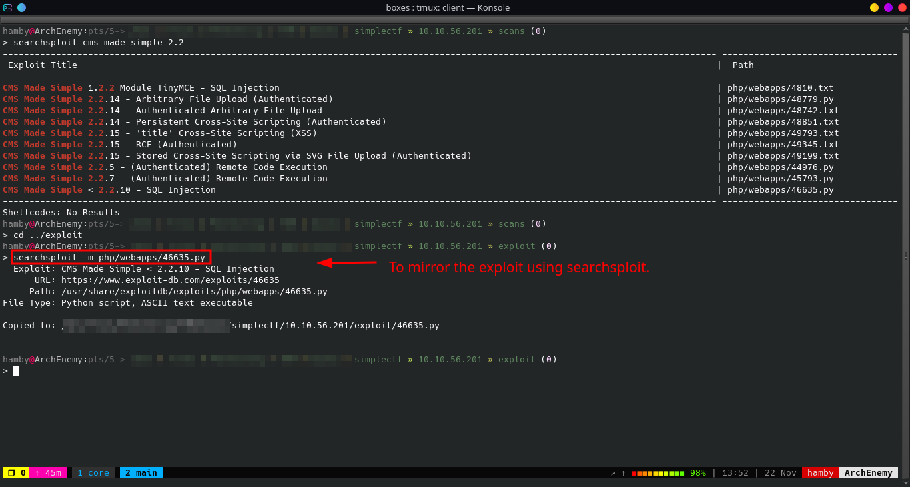

* Let's look at the exploit script and see what it does.

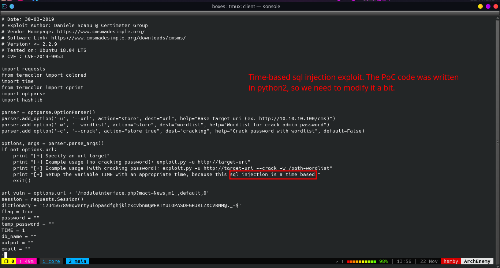

* The script is running at `python2`. We need to adjust the `print` statements to make it run in `python3`. Notice the parentheses needed for `python3` syntax. `{STATEMENT}` denotes the code after the `print` statement.
  * Changes made:
    * `print {STATEMENT}` to `print({STATEMENT})`
    * `TIME` variable set to `2` instead of `1`.
  * References for the `TIME` variable value change: [Github Gist](https://gist.github.com/pdelteil/6ebac2290a6fb33eea1af194485a22b1)

* Let's now try to exploit the `CMS` using our modified exploit script.

*Tip: When in doubt, search it in Google.*

## Exploitation

### *1st Method (SQLi Exploit script + hashcat)*

#### *Steps to reproduce:*

1. Run the exploit script using `python3`.

   * Usage: `python3 {FILE} -u {URL} -c {WORDLISTS_TO_USE_FOR_CRACKING}`

    

2. Wait for the exploit script to finish and it should give the `salt` and `password` hash of `Mitch` user as seen as the image below.

    

3. We can now use `hashcat` to bruteforce the `password` and `salt` hash using `rockyou.txt`.
   * Syntax: `hashcat -m 10 {PASSWORD:SALT} {PATH_TO_WORDLIST}`

4. We can now login via `SSH` using the credentials found by `hashcat`.
   * Syntax: `ssh {USER}@{IP} -p {PORT}`

*Note: I did not use the `hashcat` method because I ran some issues in my Arch Linux not running my discrete GPU for cracking.*

### *2nd Method (Hydra)*

#### *Steps to Reproduce*

1. With `hydra` installed, we can now try to bruteforce system credentials of `Mitch` user knowing that he/she has weak password and reused his/her password in system machine.
   1. Syntax: `hydra -l {USERNAME} -P {PATH_TO_WORDLIST} ssh://{IP:PORT}`

2. Wait for `hydra` to finish and it should show the credentials for `Mitch` user.

    

3. We can now login to `SSH` service at port `2222` using the newly found credentials.

    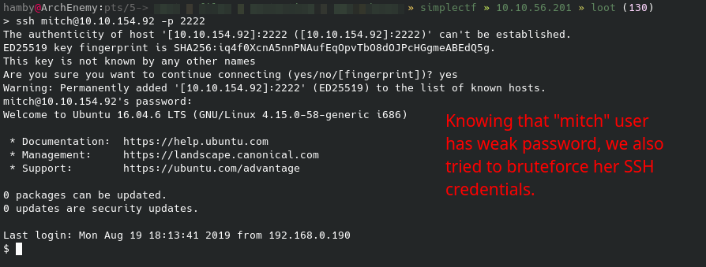

#### Table 1.2: Credentials Found

Username | Password
:---: | :---:
mitch | secret

* Let's now start enumerating internal services of the machine!

## Privilege Escalation / Post-Exploitation

### *Internal Enumeration*

#### Table 1.3: Checklist for Linux Internal Enumeration

COMMAND | DESCRIPTION
:---: | :---:
``ss -tlnp``  | lists all sockets (``-t = tcp``) (``-l = listening``) (``-n = numeric``) (``-p = processes``)
``netstat -tulnp`` | &nbsp; |  &nbsp;
``sudo -l`` | lists all binaries/files/programs the current user has ``sudo`` permissions. (might require password)
``find / -type f -user root -perm -u+s 2>/dev/null`` | finds files in ``/`` directory that has [SUID](https://www.hackingarticles.in/linux-privilege-escalation-using-suid-binaries/) bit set. If any, consult [GTFOBins](https://gtfobins.github.io/).
``uname -a`` | prints system information (-a = all)
``whoami && id`` | prints `effective userid` (EUID) and prints `real` and `effective userid` and `groupids` (GID).

*Notes: For more information about the commands look [here](https://explainshell.com)*

*Tip: When nothing else makes sense, try to use [LinPEAS](https://github.com/carlospolop/PEASS-ng) ([winPEAS](https://github.com/carlospolop/PEASS-ng) for windows machines.).*

#### *Vertical Privilege Escalation*

* Running our checklist, we found that using `sudo -l`, `Mitch` user can use `/usr/bin/vim` as `root` user **without** password!

    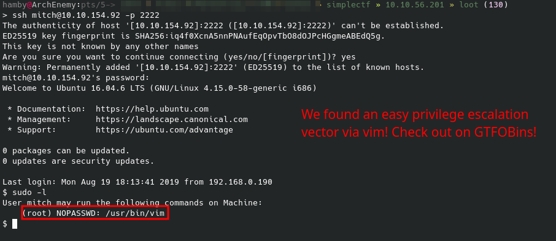

  * To escalate our privileges, simply type in the terminal:
    * Syntax: `sudo /usr/bin/vim`
    * Then: Press `ESC`
    * Then: Press `SHIFT + ;` *to make colon (:)*
    * Then: Type `!sh`
  * This should make us spawn a `root` shell.

    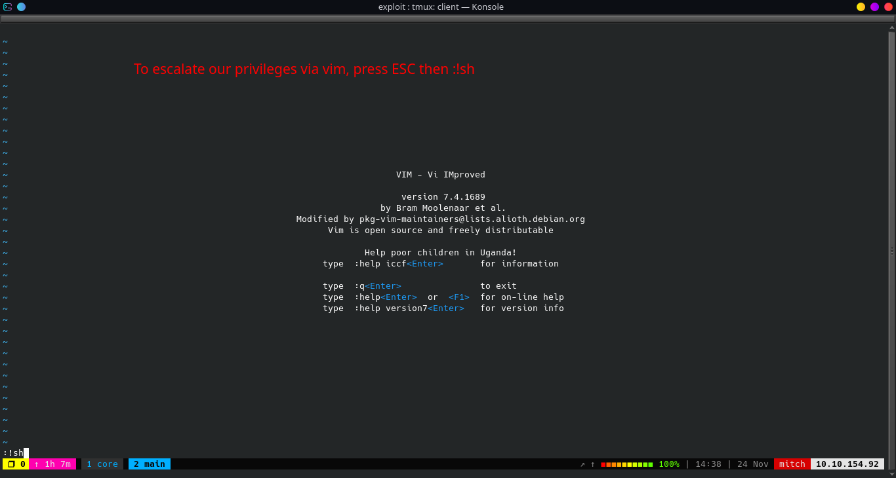

    
* We are now **root** user!

* To finish the machine, get the contents of `user.txt` and `root.txt` and also the necessary answers for completion.

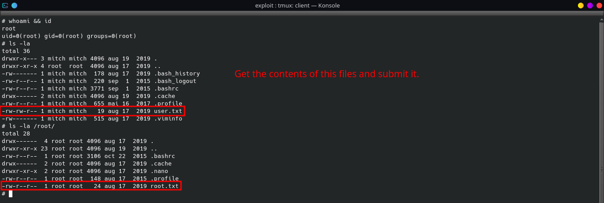

### STATUS: ROOTED

The next two steps are not necessary for completion of the machine but it completes the 5 Phases of Penetration Testing.

## Post Exploitation / Maintaining Access

* Copied the /etc/shadow file for user identification and their passwords.

* Added another root user for easy access.

## Clearing Tracks

* Removed all logs and footprints to to prevent risk of exposure of breach to security administrator.

## Status: Finished

Feel free to reach out and if there is something wrong about the above post. Feedbacks are also appreciated :D

## Donation Box

### *Not required but appreciated :D*

[](https://ko-fi.com/hambyhaxx)

[](https://www.buymeacoffee.com/hambyhaxx)

### Socials

* [Twitter](https://twitter.com/hambyhaxx)
* [Github](https://github.com/hambyhacks)
* [Medium Version](https://hambyhaxx.medium.com/tryhackme-simplectf-47a8d0d50aeb)

<-- [Go Back](https://hambyhacks.github.io)
